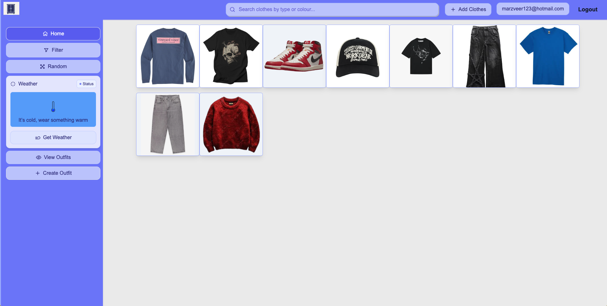

# Almaari Organizer

**Author:** Manveer Sohal  
[manveersohalwork@gmail.com](mailto:manveersohalwork@gmail.com)  
647-830-5602  
[github.com/manveer-sohal/AlmaariOrganized](https://github.com/manveer-sohal/AlmaariOrganized)

---

## Project Overview

**Almaari Organizer** is a cloud-hosted wardrobe management platform designed to help users digitally catalog and organize their clothing collections.

Users can upload, categorize, and search for items through a fast and intuitive interface. The system integrates a cloud-based image upload pipeline, secure user authentication, and responsive filtering capabilities to deliver a seamless wardrobe management experience.


_Main dashboard interface of Almaari Organizer showcasing the clothing grid and category filters._

---

## Technology Stack

**Frontend:** TypeScript, React, Next.js, Tailwind CSS  
**Backend:** Node.js (Express), MongoDB, Auth0  
**Infrastructure:** Docker, Google Cloud Run, AWS S3  
**Additional:** Redis (for caching)

---

## Key Features and Contributions

- Full-stack, Dockerized architecture built for modularity and scalability.
- Cloud deployment on **Google Cloud Run** with zero-downtime rollouts.
- Secure image storage integrated with **AWS S3** using **presigned URLs**.
- Redis caching to improve data reload speed after refreshes.
- Secure authentication and authorization using **Auth0**.
- Responsive UI built with **React** and **Tailwind CSS**.
- Automated CI/CD pipelines for continuous testing and deployment.

---

## Technical Highlight: AWS S3 Image Storage Pipeline

Implemented a secure, scalable image upload workflow using **AWS S3 presigned URLs** to avoid routing large files through the backend.

### Upload Flow

1. Frontend requests a presigned URL from the backend.
2. Backend generates the signed URL using the AWS SDK.
3. Frontend uploads the image directly to S3.
4. Backend saves an image reference in MongoDB.

```json
{
  "user_id": "123",
  "s3_key": "user_123/shirt_blue.png",
  "category": null,
  "cropped": false
}
```


_Sequence flowchart of AWS S3 image upload pipeline._

This design improved reliability and throughput for file uploads, allowing high-volume concurrent operations with minimal backend load.

## Data Architecture and Design Decisions

The database design uses **MongoDB** with three main collections:
• User
• Clothes
• Outfits

Each clothing item and outfit is stored as an independent document linked to a user ID. This normalized design increases modularity and scalability as the platform grows.

### Schema Implementation (Mongoose)

```js
// Clothes Schema
const ClothesSchema = new mongoose.Schema({
  uniqueId: { type: String, required: true, unique: true },
  type: { type: String, required: true, index: true },
  imageSrc: { type: String, required: true },
  favourite: { type: Boolean, default: false },
  createdAt: { type: Date, default: Date.now },
  colour: { type: [String], required: true },
  season: { type: [String], default: [] },
  waterproof: { type: Boolean, default: false },
  slot: { type: String, required: true },
});

// Outfits Schema
const OutfitsSchema = new mongoose.Schema({
  uniqueId: { type: String, required: true, unique: true },
  name: { type: String, default: "" },
  favourite: { type: Boolean, default: false },
  createdAt: { type: Date, default: Date.now },
  colour: { type: [String], required: true },
  season: { type: [String], default: [] },
  waterproof: { type: Boolean, default: false },
  outfit_items: [{ type: mongoose.Schema.Types.ObjectId, ref: "Clothes" }],
});

// User Schema
const usersSchema = new mongoose.Schema({
  auth0Id: { type: String, required: true, unique: true, index: true },
  email: { type: String, required: true },
  clothes: [{ type: mongoose.Schema.Types.ObjectId, ref: "Clothes" }],
  outfits: [{ type: mongoose.Schema.Types.ObjectId, ref: "Outfits" }],
});
```


_Database relationship diagram showing User–Clothes–Outfits references._

## Schema Breakdown and Efficiency Rationale

    •	Each clothing item is stored as a separate document, allowing **parallel indexing** and faster retrieval.
    •	Logical separation between collections improves scalability and enables global queries (e.g., “all blue shirts”).
    •	Arrays such as colour and season support flexible metadata tagging.
    •	MongoDB’s dynamic structure allows adding new fields like material or style without schema migration.

## Drawbacks and Trade-offs

While the main goal of Almaari Organizer is to provide a fast, user-friendly wardrobe storage system, advanced data analytics is not a current design priority.
The architecture is optimized for real-time interaction—quick uploads, filtering, and data reloads—rather than analytical queries.

MongoDB was chosen for its flexibility, horizontal scalability, and ability to handle frequent writes efficiently.
However, if analytical insights such as “most worn color per month” become core features, MongoDB’s unstructured nature would introduce aggregation overhead.

**Summary**
• MongoDB is not optimal for analytics-heavy workloads.
• **PostgreSQL** offers stronger performance for relational joins and aggregations.
• Future enhancement: a hybrid system combining MongoDB (operations) and PostgreSQL (analytics).

## Impact and Outcomes

• Reduced API response times by **25%** through query optimization and indexing.
• Improved data reload speeds using **Redis caching** for faster refreshes.
• Designed a scalable cloud architecture supporting seamless deployment and user growth.

**Repository**

github.com/manveer-sohal/AlmaariOrganized
