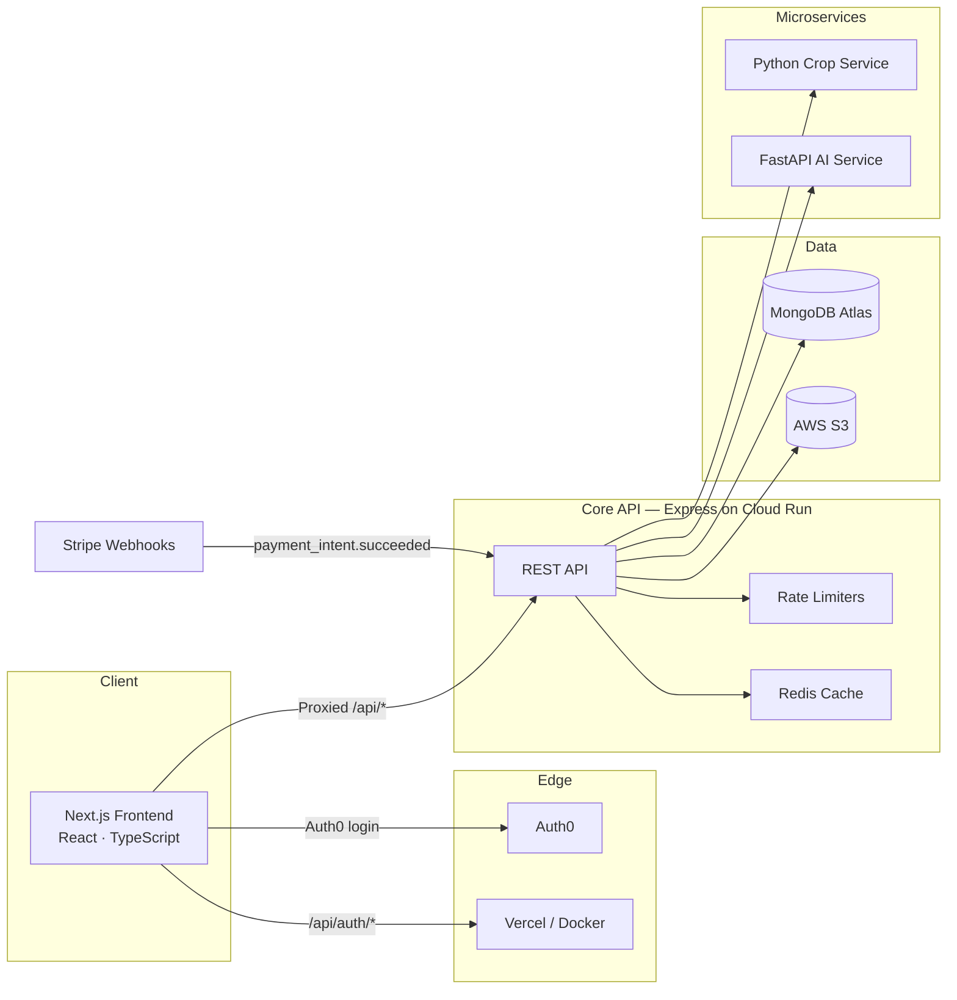

# Almaari Organizer

**Author:** Manveer Sohal  
[manveersohalwork@gmail.com](mailto:manveersohalwork@gmail.com) · 647-830-5602 · [github.com/manveer-sohal/AlmaariOrganized](https://github.com/manveer-sohal/AlmaariOrganized)

---

## 1. Project Overview & Impact

**Almaari Organizer** is a production-grade, cloud-hosted wardrobe management platform that helps users digitize, organize, and style their clothing collections from any device. It solves a real consumer problem: closets are opaque, outfit planning is manual, and wardrobe metadata (color, fit, season, material) is tedious to maintain.

By combining AI-assisted tagging, visual outfit composition, and weather-aware recommendations, the platform turns a physical wardrobe into a searchable, actionable digital asset. The result is faster daily outfit decisions, consistent visual presentation across the catalog, and a scalable foundation for monetized AI features through a credit-based billing model.

Dashboard


---

## 2. Key Features & Technologies

- **Digital Wardrobe Catalog & Smart Filtering** — Users upload, categorize, favorite, and search clothing by type, color, season, material, fit, and pattern. Built with **Next.js 16**, **React 19**, **TypeScript**, and **Tailwind CSS**, with **Zustand** and **TanStack Query** for responsive client state and server-state synchronization across large clothing grids.
- **AI-Powered Clothing Analysis** — Upload a photo and receive auto-extracted metadata (type, color, material, fit, pattern) via a dedicated **FastAPI** microservice. The Node.js API orchestrates requests, enforces per-user rate limits, deducts credits atomically, and refunds on low-confidence results. Instrumented end-to-end with request tracing and performance logging.
- **Image Normalization Pipeline** — A **Python** background-removal and cropping microservice processes garment images into consistent, transparent PNGs for grid and outfit views. The **Express** backend orchestrates validation, forwarding, and persistence while keeping CPU-intensive work off the main API thread.
- **Outfit Builder & AI Stylist** — Users compose outfits from their catalog and receive contextual styling guidance (casual, street, formal profiles) through an in-app AI stylist. Powered by **MongoDB** document references linking users → clothes → outfits, with indexed queries for fast retrieval at scale.
- **Monetized Credit System with Stripe** — Users purchase AI analysis credits through **Stripe Payment Intents** with server-side package validation, webhook-verified fulfillment, and idempotent purchase records. Frontend checkout uses **@stripe/react-stripe-js**; backend fulfillment is webhook-only — credits are never granted from client-side success callbacks.
- **Secure Authentication & Production Deployment** — **Auth0** handles identity (OAuth 2.0 / OIDC) with JWT validation on protected API routes, server-only user bootstrap on login, and role-based admin access. The backend deploys to **Google Cloud Run** via **GitHub Actions** CI/CD; images are containerized with **Docker**. **Redis (Upstash)** caches wardrobe and outfit payloads with graceful MongoDB fallback.

---

## 3. Architecture & System Design

Almaari Organizer uses a **modular monolith + specialized microservices** architecture. The core product API is a single **Node.js / Express** service responsible for business logic, auth, billing, and orchestration. Compute-heavy or language-specific workloads are delegated to standalone services, keeping the main API lean and horizontally scalable on Cloud Run.


```mermaid
flowchart LR
  subgraph Client
    FE[Next.js Frontend<br/>React · TypeScript]
  end

  subgraph Edge
    AUTH[Auth0]
    VERCEL[Vercel / Docker]
  end

  subgraph CoreAPI[Core API — Express on Cloud Run]
    API[REST API]
    RL[Rate Limiters]
    CACHE[Redis Cache]
  end

  subgraph Data
    MONGO[(MongoDB Atlas)]
    S3[(AWS S3)]
  end

  subgraph Microservices
    CROP[Python Crop Service]
    AI[FastAPI AI Service]
  end

  STRIPE[Stripe Webhooks]

  FE -->|Auth0 login| AUTH
  FE -->|/api/auth/*| VERCEL
  FE -->|Proxied /api/*| API
  API --> RL
  API --> CACHE
  API --> MONGO
  API --> S3
  API --> CROP
  API --> AI
  STRIPE -->|payment_intent.succeeded| API
```

### Why this architecture

| Decision                                      | Rationale                                                                                                                                                                                                 |
| --------------------------------------------- | --------------------------------------------------------------------------------------------------------------------------------------------------------------------------------------------------------- |
| **Modular monolith (not full microservices)** | Wardrobe CRUD, billing, and auth share the same data model and transaction boundaries. A single deployable API reduces operational overhead while remaining decomposable.                                 |
| **External Python / FastAPI services**        | Image processing and ML inference are CPU-bound and benefit from Python's ecosystem. Isolating them prevents upload spikes from degrading core API latency.                                               |
| **Next.js as BFF (Backend-for-Frontend)**     | Auth0 session handling and access-token refresh live on the Next.js server. API routes are proxied to Cloud Run via `next.config.ts` rewrites, so the browser never holds backend secrets.                |
| **MongoDB document model**                    | Clothing items and outfits are naturally document-shaped with flexible metadata arrays (color, season). Indexed queries on `userId`, `type`, and `color` support fast filtering without relational joins. |
| **Redis with graceful degradation**           | Wardrobe and outfit lists are cached (10-minute TTL). If Redis is unavailable, the API falls back to MongoDB transparently — no user-facing failure.                                                      |
| **Stripe webhook fulfillment**                | Credits are granted only after cryptographically verified webhook events, with atomic `pending → fulfilled` transitions preventing double-crediting.                                                      |

### Request flow (clothing upload + AI analyze)

1. **Frontend** — User crops an image client-side and submits metadata.
2. **Express API** — Validates auth (Auth0 JWT), file size/dimensions, and rate limits.
3. **Python Crop Service** — Removes background, normalizes to square transparent PNG.
4. **MongoDB** — Persists clothing document; invalidates Redis cache.
5. **(Optional) FastAPI AI Service** — Analyzes image, returns tags; one credit deducted atomically with refund on failure.

S3 Pipeline


Database Design


---

## 4. My Contributions & Engineering Highlights

This project was designed, built, and deployed end-to-end by **Manveer Sohal** (300+ commits). Key engineering contributions:

### Performance & Scalability

- **Reduced API response times by ~25%** through MongoDB compound indexing (`userId + type + createdAt`, `userId + colour + createdAt`) and Redis caching for wardrobe/outfit reads.
- **Reduced user form completion time by ~5 seconds** by introducing AI-powered metadata generation, moving image cropping into an asynchronous background service, and optimizing the AI processing pipeline to eliminate blocking operations.
- Implemented **graceful Redis degradation** — a no-op shim activates on connection failure so the API never crashes when cache is unavailable.
- Added **AI and upload rate limiters** (`express-rate-limit`) with per-route caps and reverse-proxy-aware IP detection (`trust proxy`).

### Image & AI Pipeline

- Architected a **three-layer image pipeline** (Next.js → Express → Python) with client-side cropping, server-side validation, and microservice-based background removal.
- Built **AI clothing analysis orchestration** with credit reservation, automatic refund on low-confidence tags, request-ID tracing, and step-level performance logging across the full analyze path.
- Prototyped **AWS S3 presigned URL uploads** to route large files directly to object storage, minimizing backend memory and throughput bottlenecks.

### Billing & Monetization

- Designed and implemented a **full Stripe billing flow**: Payment Intent creation, webhook signature verification, idempotent purchase fulfillment, and client-side checkout with `@stripe/react-stripe-js`.
- Enforced **server-side package resolution** — the frontend sends only a `packageId`; amount and credits are never trusted from the client.
- Built atomic **credit deduction/refund** using MongoDB aggregation pipelines to prevent race conditions during concurrent AI requests.

### Security & Auth

- Integrated **Auth0** with JWT validation middleware, server-only user bootstrap (`INTERNAL_API_SECRET`), and centralized `getAuthHeaders` token management with 401 retry logic across all frontend hooks.
- Separated Stripe webhook raw-body parsing from JSON middleware to ensure signature verification integrity.
- Added **role-based admin middleware** for protected feedback management routes.

### DevOps & Quality

- Containerized the full stack with **Docker Compose** for local development (hot-reload on both frontend and backend).
- Automated **zero-downtime deployments to Google Cloud Run** via GitHub Actions on every push to `main`.
- Authored **Mocha/Supertest** integration tests (clothes CRUD, billing auth) and **Playwright** E2E tests (Auth0 login setup, credit purchase flow).
- Implemented **interactive onboarding tours** (driver.js) to improve first-time user activation for wardrobe and outfit features.

---

## 5. Setup & Installation

### Prerequisites

| Requirement                 | Version / Notes                                                                              |
| --------------------------- | -------------------------------------------------------------------------------------------- |
| **Node.js**                 | 18.x or 20.x (backend Dockerfile uses 18; production image uses 20)                          |
| **npm**                     | 9+                                                                                           |
| **Docker & Docker Compose** | For containerized local development                                                          |
| **MongoDB**                 | Atlas cluster (recommended) or local via Docker profile                                      |
| **Auth0**                   | Tenant with a configured API (audience) and application                                      |
| **Redis**                   | Upstash or local (optional — app degrades gracefully without it)                             |
| **Stripe**                  | Test-mode keys for billing features                                                          |
| **External services**       | Python crop microservice URL, FastAPI AI clothing service URL, Tomorrow.io API key (weather) |

### Quick Start (Docker Compose)

```bash
# 1. Clone the repository
git clone https://github.com/manveer-sohal/AlmaariOrganized.git
cd AlmaariOrganized

# 2. Configure environment variables (see below)
cp backend/.env.example backend/.env
# Create frontend/.env.local with Auth0 and API settings

# 3. Start all services
docker compose up --build

# Frontend → http://localhost:3000
# Backend API → http://localhost:3001
```

To run a **local MongoDB** container instead of Atlas:

```bash
docker compose --profile local-db up --build
```

### Manual Setup (without Docker)

```bash
# Backend
cd backend
cp .env.example .env   # fill in values
npm install
npm run dev            # starts on port 8080 (or PORT from .env)

# Frontend (separate terminal)
cd frontend
npm install
npm run dev            # starts on port 3000
```

### Environment Variables

#### Backend (`backend/.env`)

Copy from `backend/.env.example` and configure:

| Variable                  | Purpose                                               |
| ------------------------- | ----------------------------------------------------- |
| `MONGODB_URI`             | MongoDB connection string                             |
| `REDIS_URL`               | Redis connection URL (optional)                       |
| `CORS_ORIGIN`             | Allowed frontend origins (comma-separated)            |
| `INTERNAL_API_SECRET`     | Shared secret for server-to-server user bootstrap     |
| `AUTH0_DOMAIN`            | Auth0 tenant domain (e.g. `your-tenant.us.auth0.com`) |
| `AUTH0_AUDIENCE`          | Auth0 API identifier — must match frontend            |
| `STRIPE_SECRET_KEY`       | Stripe secret key (server-only)                       |
| `STRIPE_PUBLISHABLE_KEY`  | Stripe publishable key (returned to frontend via API) |
| `STRIPE_WEBHOOK_SECRET`   | Stripe webhook signing secret                         |
| `CROP_SERVICE_URL`        | Python image cropper microservice endpoint            |
| `AI_CLOTHING_SERVICE_URL` | FastAPI clothing analysis service endpoint            |
| `TOMORROW_API_KEY`        | Weather API key                                       |
| `UPLOAD_MAX_BYTES`        | Max upload size in bytes (default: 5 MB)              |
| `RATE_LIMIT_*`            | Per-route rate limit overrides                        |

#### Frontend (`frontend/.env.local`)

| Variable                   | Purpose                                                                   |
| -------------------------- | ------------------------------------------------------------------------- |
| `AUTH0_SECRET`             | Random 32+ character secret for session encryption                        |
| `AUTH0_BASE_URL`           | App URL (e.g. `http://localhost:3000`)                                    |
| `AUTH0_ISSUER_BASE_URL`    | Auth0 tenant URL (e.g. `https://your-tenant.us.auth0.com`)                |
| `AUTH0_CLIENT_ID`          | Auth0 application client ID                                               |
| `AUTH0_CLIENT_SECRET`      | Auth0 application client secret                                           |
| `AUTH0_AUDIENCE`           | Auth0 API identifier — must match backend                                 |
| `AUTH0_SCOPE`              | `openid profile email offline_access`                                     |
| `NEXT_PUBLIC_API_BASE_URL` | Backend URL (e.g. `http://localhost:3001` or `http://api:8080` in Docker) |
| `INTERNAL_API_SECRET`      | Same value as backend — used for post-login user bootstrap                |

#### E2E Testing (optional)

| Variable              | Purpose                                                       |
| --------------------- | ------------------------------------------------------------- |
| `E2E_AUTH0_EMAIL`     | Test user email for Playwright auth setup                     |
| `E2E_AUTH0_PASSWORD`  | Test user password                                            |
| `PLAYWRIGHT_BASE_URL` | Frontend URL for E2E tests (default: `http://localhost:3000`) |

```bash
# Run backend tests
cd backend && npm test

# Run frontend E2E tests (requires running app + Auth0 test user)
cd frontend && npx playwright test
```

### Stripe Webhook (local development)

```bash
stripe listen --forward-to localhost:3001/api/billing/stripe-webhook
# Copy the webhook signing secret into STRIPE_WEBHOOK_SECRET
```

---

## Repository

[github.com/manveer-sohal/AlmaariOrganized](https://github.com/manveer-sohal/AlmaariOrganized)
