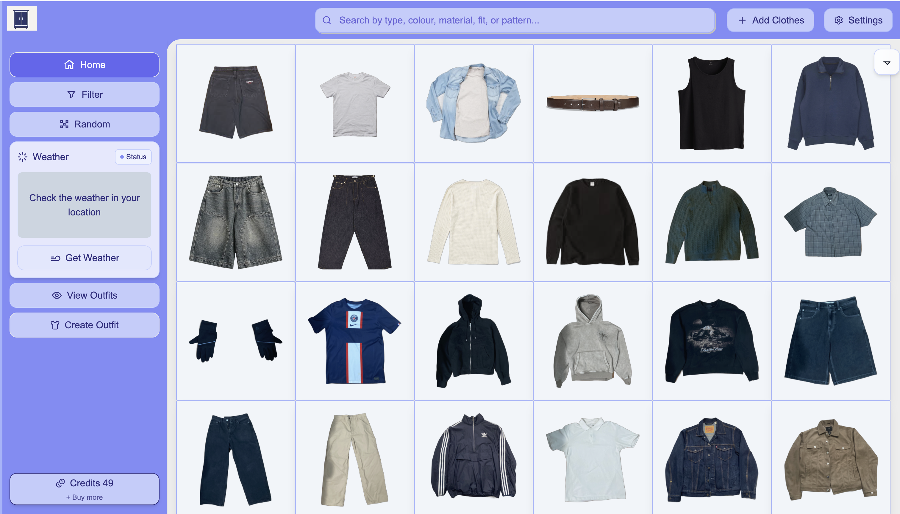
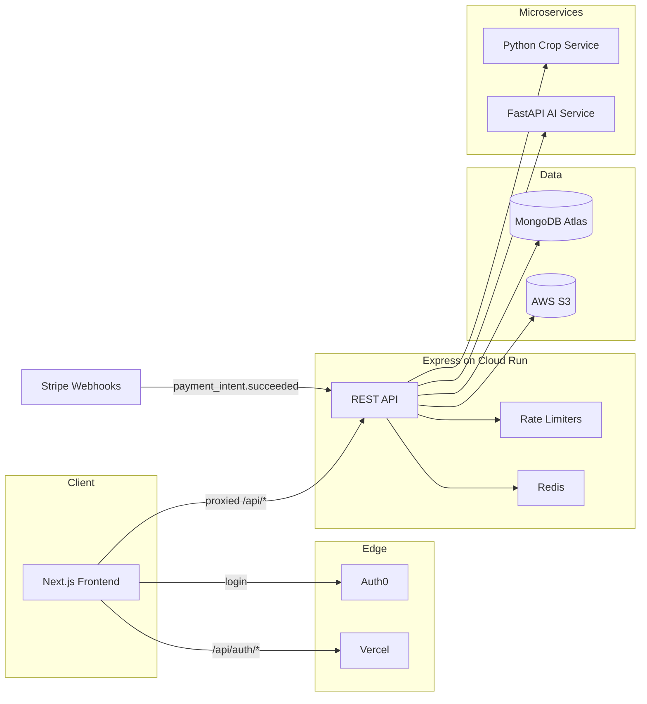
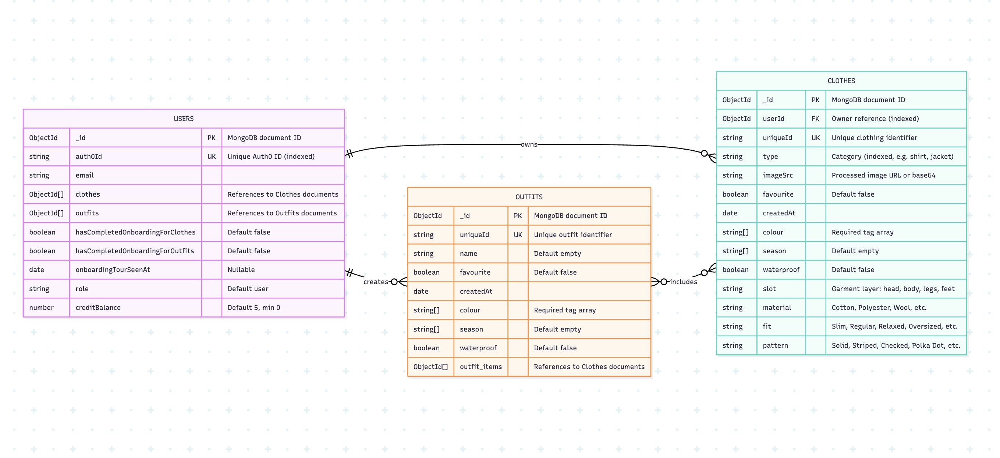
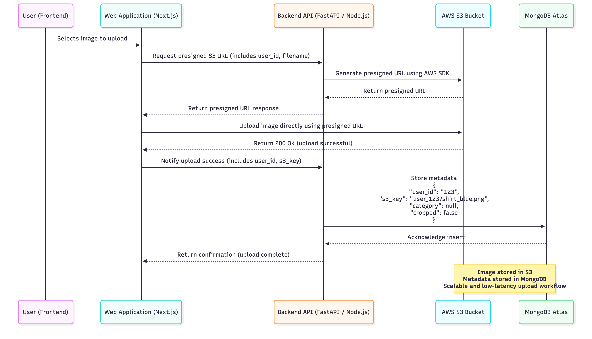

# Almaari Organizer

**Author:** Manveer Sohal  
[manveersohalwork@gmail.com](mailto:manveersohalwork@gmail.com) · 647-830-5602 · [GitHub](https://github.com/manveer-sohal/AlmaariOrganized)

A cloud-hosted wardrobe platform that turns a physical closet into a searchable digital catalog — with AI clothing analysis, weather-aware outfit recommendations, and credit-based monetization.



---

## Why it exists

Closets are hard to search, outfit planning is manual, and tagging every garment (color, fit, season, material) is tedious. Almaari digitizes the wardrobe, auto-tags uploads with AI, and recommends outfits grounded only in what the user owns.

---

## Tech stack

| Layer | Technologies |
| ----- | ------------ |
| **Frontend** | Next.js 16, React 19, TypeScript, Tailwind CSS, Zustand, TanStack Query |
| **API** | Node.js, Express, MongoDB Atlas, Redis (Upstash) |
| **Auth & billing** | Auth0 (OAuth 2.0 / OIDC), Stripe Payment Intents + webhooks |
| **AI & media** | FastAPI (vision tagging), Python crop service, OpenAI (optional stylist rerank), AWS S3 |
| **Infra** | Docker, GitHub Actions → Google Cloud Run, Vercel |

---

## What it does

- **Digital wardrobe** — Upload, categorize, favorite, and filter clothes by type, color, season, material, fit, and pattern.
- **AI clothing analysis** — Photo → structured metadata (type, color, material, fit, pattern, styling fields) via FastAPI, with credit metering and automatic refunds on low-confidence results.
- **Image normalization** — Background removal and transparent PNGs via a dedicated Python crop microservice so the catalog looks consistent.
- **Outfit builder & AI stylist** — Manual composition or three wardrobe-only looks (Safe / Styled / Alternative), with 👍/👎 feedback shaping later sessions.
- **Credits & Stripe** — Users buy AI credits; fulfillment is webhook-only and idempotent — never from client-side success callbacks.
- **Auth & deploy** — Auth0 JWTs on protected routes; API on Cloud Run; Redis cache with MongoDB fallback.

---

## Architecture at a glance

Modular monolith for product logic (wardrobe, billing, auth, orchestration) plus specialized microservices for CPU-bound vision and image work.


```mermaid
flowchart LR
  subgraph Client
    FE[Next.js Frontend]
  end

  subgraph Edge
    AUTH[Auth0]
    VERCEL[Vercel]
  end

  subgraph CoreAPI[Express on Cloud Run]
    API[REST API]
    RL[Rate Limiters]
    CACHE[Redis]
  end

  subgraph Data
    MONGO[(MongoDB Atlas)]
    S3[(AWS S3)]
  end

  subgraph Microservices
    CROP[Python Crop Service]
    AI[FastAPI AI Service]
  end

  STRIPE[Stripe Webhooks]

  FE -->|login| AUTH
  FE -->|/api/auth/*| VERCEL
  FE -->|proxied /api/*| API
  API --> RL
  API --> CACHE
  API --> MONGO
  API --> S3
  API --> CROP
  API --> AI
  STRIPE -->|payment_intent.succeeded| API
```

| Decision | Why |
| -------- | --- |
| Modular monolith + 2 Python services | Shared data/transactions for CRUD & billing; isolate CPU-heavy CV and inference |
| Next.js as BFF | Auth0 sessions and secrets stay server-side; browser never holds backend keys |
| MongoDB documents | Flexible clothing metadata; indexes on `userId`, type, color for fast filters |
| Redis with fallback | Cached wardrobe/outfit reads; MongoDB if Redis is down |
| Stripe webhook fulfillment | Credits only after verified events; atomic `pending → fulfilled` prevents double-crediting |



---

## AI Stylist (overview)

The stylist is an **orchestration pipeline**, not a free-form chat. Express owns auth, credits, wardrobe ownership, and validation. Models only score or rerank candidates built from the user’s closet.

**Flow (short):** validate → load wardrobe → generate slot-aware candidates → deterministic score → optional OpenAI rerank → validate every `itemId` → return three looks. 👍/👎 feedback updates preference weights on the **next** generation.

**Design rules worth noting:**
- Every recommended item must belong to the authenticated user
- One credit per successful 3-look session; refund on failure
- If OpenAI is unavailable, deterministic scoring still returns outfits

→ **Deep dive:** [AI Stylist System](./docs/ai-stylist.md)  
→ **Contract:** [AI styling metadata (Node ↔ FastAPI)](./docs/ai-styling-metadata-contract.md)

---

## Image processing & S3 (overview)

Uploads go through validation and a Python crop service for background removal / transparent PNGs. Optional AI analysis tags the garment and deducts credits. Large-object upload design uses **AWS S3 presigned URLs** so binary traffic does not saturate the API.

```
Upload → validate → crop service → (optional) FastAPI analyze → sanitize tags → persist
```



→ **Deep dive:** [Image Pipeline & S3](./docs/image-pipeline-s3.md)

---

## Engineering highlights

Built and deployed end-to-end (300+ commits). Selected outcomes:

- **~25% faster API reads** via compound MongoDB indexes and Redis caching
- **~5s faster add-clothing flow** with AI tagging + async crop off the main API thread
- **Atomic credit reserve/refund** so concurrent AI calls cannot double-charge
- **Structured observability** — `X-Request-Id` tracing, JSON logs with PII redaction, `/metrics/ai`
- **CI/CD** — Docker → GitHub Actions → Cloud Run; Mocha/Supertest + Playwright coverage

---

## Quick start

**Prerequisites:** Node 18/20, Docker (recommended), MongoDB Atlas (or local), Auth0 tenant. Optional: Redis, Stripe test keys, crop/AI service URLs.

```bash
git clone https://github.com/manveer-sohal/AlmaariOrganized.git
cd AlmaariOrganized

cp backend/.env.example backend/.env
# Create frontend/.env.local (Auth0 + API settings — see below)

docker compose up --build
# Frontend → http://localhost:3000
# Backend  → http://localhost:3001
```

Local MongoDB instead of Atlas:

```bash
docker compose --profile local-db up --build
```

### Environment variables

<details>
<summary><strong>Backend</strong> (<code>backend/.env</code>)</summary>

| Variable | Purpose |
| -------- | ------- |
| `MONGODB_URI` | MongoDB connection string |
| `REDIS_URL` | Redis URL (optional) |
| `CORS_ORIGIN` | Allowed frontend origins |
| `INTERNAL_API_SECRET` | Server-to-server user bootstrap |
| `AUTH0_DOMAIN` / `AUTH0_AUDIENCE` | Auth0 API config |
| `STRIPE_SECRET_KEY` / `STRIPE_WEBHOOK_SECRET` | Billing |
| `CROP_SERVICE_URL` | Python crop microservice |
| `AI_CLOTHING_SERVICE_URL` | FastAPI analysis service |
| `TOMORROW_API_KEY` | Weather |
| `UPLOAD_MAX_BYTES` | Max upload size (default 5 MB) |

</details>

<details>
<summary><strong>Frontend</strong> (<code>frontend/.env.local</code>)</summary>

| Variable | Purpose |
| -------- | ------- |
| `AUTH0_SECRET` | Session encryption (32+ chars) |
| `AUTH0_BASE_URL` | App URL (e.g. `http://localhost:3000`) |
| `AUTH0_ISSUER_BASE_URL` / `AUTH0_CLIENT_ID` / `AUTH0_CLIENT_SECRET` | Auth0 app |
| `AUTH0_AUDIENCE` / `AUTH0_SCOPE` | Must match backend audience |
| `NEXT_PUBLIC_API_BASE_URL` | Backend URL |
| `INTERNAL_API_SECRET` | Same as backend |

</details>

```bash
# Backend tests
cd backend && npm test

# Frontend E2E (app running + Auth0 test user)
cd frontend && npx playwright test

# Local Stripe webhooks
stripe listen --forward-to localhost:3001/api/billing/stripe-webhook
```

---

## Documentation

| Doc | Audience |
| --- | -------- |
| [AI Stylist System](./docs/ai-stylist.md) | How recommendations, scoring, feedback, and credits work |
| [Image Pipeline & S3](./docs/image-pipeline-s3.md) | Crop service, analyze flow, observability, S3 uploads |
| [AI styling metadata contract](./docs/ai-styling-metadata-contract.md) | Node ↔ FastAPI response shape and enrichment status |
| [Production readiness checklist](./docs/production-readiness-checklist.md) | Gaps and next hardening steps |
| [README v1 (archive)](./README.v1.md) | Previous long-form README |

---

## Repository

[github.com/manveer-sohal/AlmaariOrganized](https://github.com/manveer-sohal/AlmaariOrganized)
