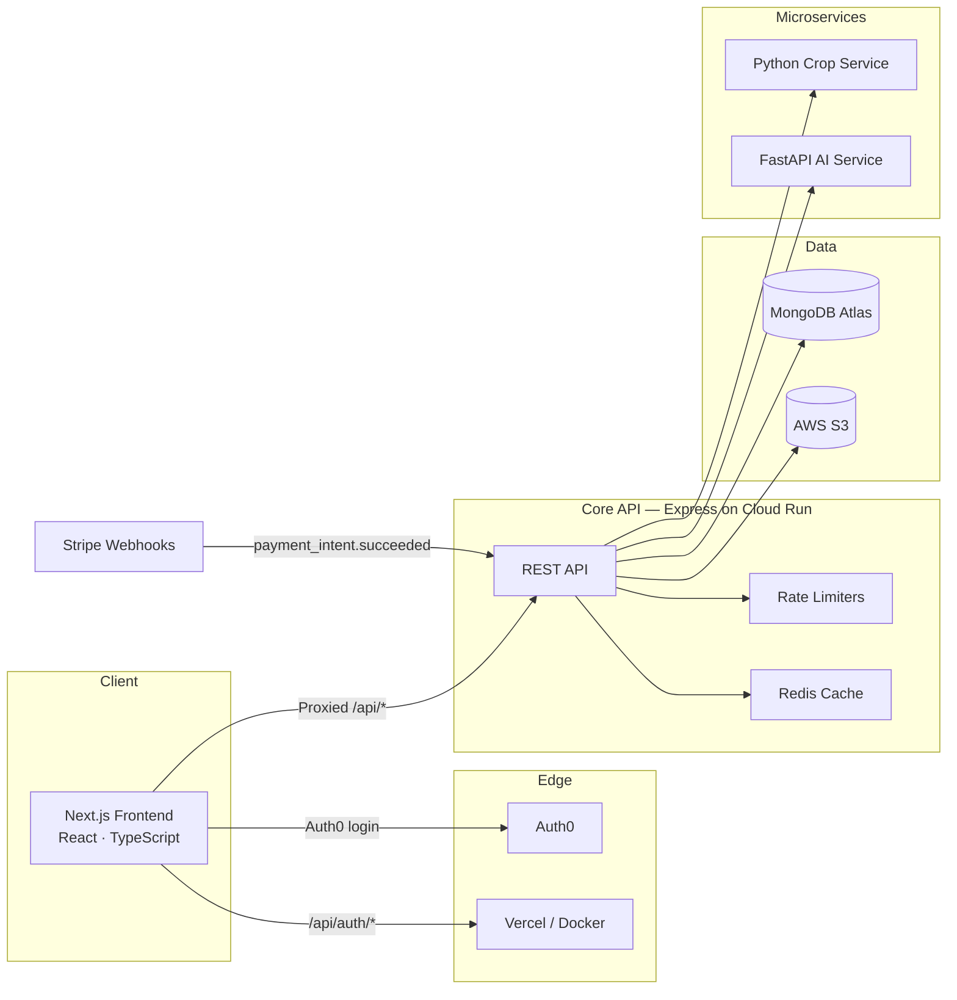

# Almaari Organizer

**Author:** Manveer Sohal  
[manveersohalwork@gmail.com](mailto:manveersohalwork@gmail.com) · 647-830-5602 · [github.com/manveer-sohal/AlmaariOrganized](https://github.com/manveer-sohal/AlmaariOrganized)

---

## 1. Project Overview & Impact

**Almaari Organizer** is a production-grade, cloud-hosted wardrobe management platform that helps users digitize, organize, and style their clothing collections from any device. It solves a real consumer problem: closets are opaque, outfit planning is manual, and wardrobe metadata (color, fit, season, material) is tedious to maintain.

By combining AI-assisted tagging, visual outfit composition, and weather-aware recommendations, the platform turns a physical wardrobe into a searchable, actionable digital asset. The result is faster daily outfit decisions, consistent visual presentation across the catalog, and a scalable foundation for monetized AI features through a credit-based billing model.

Dashboard


---

## 2. Key Features & Technologies

- **Digital Wardrobe Catalog & Smart Filtering** — Users upload, categorize, favorite, and search clothing by type, color, season, material, fit, and pattern. Built with **Next.js 16**, **React 19**, **TypeScript**, and **Tailwind CSS**, with **Zustand** and **TanStack Query** for responsive client state and server-state synchronization across large clothing grids.
- **AI-Powered Clothing Analysis** — Upload a photo and receive auto-extracted metadata (type, color, material, fit, pattern) via a dedicated **FastAPI** microservice. The Node.js API orchestrates requests, enforces per-user rate limits, deducts credits atomically, and refunds on low-confidence results. Instrumented end-to-end with request tracing and performance logging.
- **Image Normalization Pipeline** — A **Python** background-removal and cropping microservice processes garment images into consistent, transparent PNGs for grid and outfit views. The **Express** backend orchestrates validation, forwarding, and persistence while keeping CPU-intensive work off the main API thread.
- **Outfit Builder & AI Stylist** — Users compose outfits manually or generate three wardrobe-only recommendations (Safe / Styled / Alternative) via a hybrid pipeline: deterministic candidate scoring plus optional OpenAI rerank, with 👍/👎 feedback influencing later sessions. Powered by **MongoDB** document references linking users → clothes → outfits, with indexed queries for fast retrieval.
- **Monetized Credit System with Stripe** — Users purchase AI analysis credits through **Stripe Payment Intents** with server-side package validation, webhook-verified fulfillment, and idempotent purchase records. Frontend checkout uses **@stripe/react-stripe-js**; backend fulfillment is webhook-only — credits are never granted from client-side success callbacks.
- **Secure Authentication & Production Deployment** — **Auth0** handles identity (OAuth 2.0 / OIDC) with JWT validation on protected API routes, server-only user bootstrap on login, and role-based admin access. The backend deploys to **Google Cloud Run** via **GitHub Actions** CI/CD; images are containerized with **Docker**. **Redis (Upstash)** caches wardrobe and outfit payloads with graceful MongoDB fallback.

---

## 3. Architecture & System Design

Almaari Organizer uses a **modular monolith + specialized microservices** architecture. The core product API is a single **Node.js / Express** service responsible for business logic, auth, billing, and orchestration. Compute-heavy or language-specific workloads are delegated to standalone services, keeping the main API lean and horizontally scalable on Cloud Run.


```mermaid
flowchart LR
  subgraph Client
    FE[Next.js Frontend<br/>React · TypeScript]
  end

  subgraph Edge
    AUTH[Auth0]
    VERCEL[Vercel / Docker]
  end

  subgraph CoreAPI[Core API — Express on Cloud Run]
    API[REST API]
    RL[Rate Limiters]
    CACHE[Redis Cache]
  end

  subgraph Data
    MONGO[(MongoDB Atlas)]
    S3[(AWS S3)]
  end

  subgraph Microservices
    CROP[Python Crop Service]
    AI[FastAPI AI Service]
  end

  STRIPE[Stripe Webhooks]

  FE -->|Auth0 login| AUTH
  FE -->|/api/auth/*| VERCEL
  FE -->|Proxied /api/*| API
  API --> RL
  API --> CACHE
  API --> MONGO
  API --> S3
  API --> CROP
  API --> AI
  STRIPE -->|payment_intent.succeeded| API
```

### Why this architecture

| Decision                                      | Rationale                                                                                                                                                                                                 |
| --------------------------------------------- | --------------------------------------------------------------------------------------------------------------------------------------------------------------------------------------------------------- |
| **Modular monolith (not full microservices)** | Wardrobe CRUD, billing, and auth share the same data model and transaction boundaries. A single deployable API reduces operational overhead while remaining decomposable.                                 |
| **External Python / FastAPI services**        | Image processing and ML inference are CPU-bound and benefit from Python's ecosystem. Isolating them prevents upload spikes from degrading core API latency.                                               |
| **Next.js as BFF (Backend-for-Frontend)**     | Auth0 session handling and access-token refresh live on the Next.js server. API routes are proxied to Cloud Run via `next.config.ts` rewrites, so the browser never holds backend secrets.                |
| **MongoDB document model**                    | Clothing items and outfits are naturally document-shaped with flexible metadata arrays (color, season). Indexed queries on `userId`, `type`, and `color` support fast filtering without relational joins. |
| **Redis with graceful degradation**           | Wardrobe and outfit lists are cached (10-minute TTL). If Redis is unavailable, the API falls back to MongoDB transparently — no user-facing failure.                                                      |
| **Stripe webhook fulfillment**                | Credits are granted only after cryptographically verified webhook events, with atomic `pending → fulfilled` transitions preventing double-crediting.                                                      |

### AI analyze request flow

Primary path: `POST /api/ai/analyze-clothing` (Auth0 JWT required). Upload/crop is a separate path; analyze is an explicit, credit-metered call.

#### Request lifecycle

1. **Receive** — Express accepts the request behind the AI rate limiters. A request id is resolved from `X-Request-Id` or generated (`resolveAnalyzeRequestId`).
2. **Validate** — Require `req.auth.sub` and a string `image` body. Invalid auth → `401`; missing image → `400`. Validation duration and approximate payload size are timed when analyze timing logs are enabled.
3. **Credit check / reserve** — `deductOneCredit` runs before FastAPI is called. Insufficient balance → `402` (no inference).
4. **Forward** — Express POSTs the image to `AI_CLOTHING_SERVICE_URL/analyze-clothing`, forwarding `X-Request-Id` when present.
5. **Infer** — FastAPI runs vision analysis and returns tag payloads with confidence scores.
6. **Validate response** — Express sanitizes tags and counts valid fields. If `validTagCount < 1`, the reserved credit is refunded and `creditsDeducted: 0` is returned with the (empty/low-confidence) tags.
7. **Respond** — Success returns tags, `validTagCount`, `creditsDeducted`, and `creditBalance`. Errors return HTTP status from the thrown error (including upstream timeouts/unavailability), `creditsDeducted: 0`, and `creditBalance` when available. Persistence of tags into a clothing document is a separate upload/update step, not part of this endpoint.

Related: crop/normalization uses the Python crop service (`CROP_SERVICE_URL`); warmups hit FastAPI and crop concurrently and log per-service timing.

#### Observability

AI request observability is implemented in the Express API (`backend/observability/*`). FastAPI and the crop service are external; Express forwards `X-Request-Id` so those services can continue the same trace if they honor the header.

**Correlation IDs**

- Accept incoming `X-Request-Id`, otherwise generate a UUID.
- Store the id in AsyncLocalStorage for the request.
- Echo it on the response as `X-Request-Id` (CORS `exposedHeaders` includes it).
- Forward it on outbound calls to FastAPI, crop, and (for stylist) include it in structured logs around OpenAI calls.

**Structured JSON logs** (one object per line)

Fields commonly present: `timestamp`, `level`, `event`, `service`, `requestId`, `workflow`, `route`, `method`, `durationMs`, `classification`, `retryable`, `status`, `userIdHash` (SHA-256 prefix — never raw Auth0 ids), safe counts (`wardrobeItemCount`, `validTagCount`, `imageKb`).

Example:

```json
{"timestamp":"2026-07-11T22:00:00.000Z","level":"info","event":"ai.inference.completed","service":"almaari-api","requestId":"a1b2c3d4-...","workflow":"clothing_metadata_generation","durationMs":842,"validTagCount":5,"success":true}
```

**Intentionally redacted / never logged:** image/base64 payloads, Authorization headers, tokens, secrets, full prompts, full model responses, payment data.

**Timed stages**

| Workflow | Stages timed |
| -------- | ------------ |
| `clothing_metadata_generation` | validation, credit reserve, image prep, FastAPI round-trip, tag sanitize, refunds, totals |
| `image_crop_processing` | crop downstream call + total |
| `outfit_recommendation` | wardrobe load, candidate generation, deterministic scoring, optional OpenAI rerank, total |
| `outfit_reranking` | OpenAI latency; token usage when the API returns it |

**Error classification:** `validation_error`, `authentication_error`, `insufficient_credits`, `rate_limit_error`, `model_timeout`, `model_provider_error`, `invalid_model_output`, `downstream_service_error`, `image_processing_error`, `database_error`, `unknown_error` — with `retryable` hints. Clients receive safe messages; stack traces are not returned.

**Metrics:** In-process counters/timing summaries via `GET /metrics/ai` (not Prometheus/Datadog unless you export later).

**Health:** `/health` liveness; `/ready` checks MongoDB + config (Redis optional; no OpenAI probes).

Legacy `[AI Analyze]… ms` lines still emit when `AI_ANALYZE_TIMING=true` or in development, in addition to JSON events.

Separating Express (orchestration), FastAPI (inference), and the crop service (normalization) keeps failures attributable to a single hop.

#### How this supports reliability

- **Malformed requests** — Auth and body checks fail fast with clear `4xx` responses before credits or FastAPI are touched.
- **AI / upstream failures** — Classified error logs and mapped HTTP statuses show whether the fault is validation, credits, FastAPI latency/timeout, or tag quality.
- **Performance bottlenecks** — Per-stage `durationMs` isolates slow hops (FastAPI vs scoring vs OpenAI).
- **Credit integrity** — Reservation-before-inference plus `ai.credit.refund.*` events make waived/failed charges visible.
- **Production troubleshooting** — Shared `X-Request-Id` correlates frontend → Express → downstream service logs for one user action.

S3 Pipeline


Database Design


---

## 4. AI Architecture

Express is the control plane for AI workloads: it authenticates callers, enforces credits and ownership, validates inputs/outputs, and delegates inference and image normalization to specialized services. Models do not own auth, billing, or persistence.

### AI Image Processing Pipeline

```
Upload → validate → crop service → (optional) FastAPI analyze → sanitize tags → persist
```

**Orchestration vs inference**

| Component | Responsibility |
| --------- | -------------- |
| **Express** | Auth (JWT/JWKS), rate limits, upload validation, credit reserve/refund, tag sanitization, MongoDB writes, Redis invalidation |
| **Python crop service** | Background removal and image normalization (transparent PNG) |
| **FastAPI AI service** | Vision inference → structured clothing metadata with confidence scores |

Flow:

1. **Ingest** — Authenticated upload; size/MIME checks in Express. The client may call the crop endpoint first (`imageAlreadyCropped`), or Express forwards the image to the crop service during upload.
2. **Normalize** — Crop runs in a separate process. Express awaits the HTTP result but does not perform CPU-heavy CV work in-process, so the API remains deployable and scalable independently of the crop workers.
3. **Analyze (optional, credit-metered)** — `POST /api/ai/analyze-clothing` deducts one credit before calling FastAPI. The service returns tags (type, colours, material, fit, pattern) plus confidences.
4. **Safeguards** — Express sanitizes/validates tags. Empty or low-confidence results refund the reserved credit. Failures refund and surface an error without charging for unusable output.
5. **Persist** — Wardrobe documents (including AI-assisted metadata) land in MongoDB; wardrobe/outfit Redis keys are invalidated on write.

Inference is isolated from the main API process so vision load scales with the FastAPI service, not with wardrobe/billing traffic on Express.

### AI Outfit Recommendation Workflow

Outfit generation is an **orchestration pipeline**. The LLM (when enabled) reranks a shortlist; it does not authorize users, invent clothing, or settle credits.

```
validate request → load wardrobe → filter → generate candidates → score
  → optional LLM rerank → validate IDs → respond
  → (later) persist 👍/👎 feedback → influence next run
```

| Stage | Behavior |
| ----- | -------- |
| **Validate request** | Auth required; optional `anchorItemId`, occasion/weather/style/avoid |
| **Retrieve wardrobe** | Load clothes for `req.auth.sub` only |
| **Candidates** | Slot-aware combinations (top+bottom+shoes, or dress+shoes); anchor included when provided |
| **Deterministic scoring** | Colour, occasion, weather, formality, style, preference weights from prior feedback |
| **Optional LLM rerank** | OpenAI selects among top scored candidates and writes short explanations; IDs must come from the shortlist |
| **Strict validation** | Drop unknown/foreign IDs, duplicates, missing anchors, duplicate outfits |
| **Credits** | One credit reserved for a successful 3-look session; refund on failure |
| **Feedback** | 👍/👎 stored as `StylistFeedback`; applied on the **next** generation |

Generation is explicit (Generate / Style this item / Try Another). Manual selection updates the outfit preview only and does not trigger inference.

### Stylist feedback (👍 / 👎)

Feedback is stored when a user rates a recommendation, then applied on the **next** Generate / Try Another. Rating does not regenerate outfits mid-session and does not consume a credit.

```
Rate card → POST /api/ai-stylist/feedback → StylistFeedback
  → next generation → preference profile → preferenceMatch scoring → new looks
```

**What is stored**

| Field | Purpose |
| ----- | ------- |
| `recommendationId` | Which card was rated |
| `outfitItemIds` | Clothing IDs in that look (ownership-validated) |
| `outfitSignature` | Sorted ID join for “don’t repeat this exact combo” |
| `rating` | `positive` or `negative` |
| `label` / `occasion` / `style` | Optional context for later analytics and scoped preferences |

**How the next generation uses it**

1. Load recent feedback for the authenticated user (contextual to occasion/style when possible).
2. Resolve item IDs → types/colours; build Laplace-smoothed weights in `[-1, 1]`.
3. Add `preferenceMatch × 0.12` into deterministic outfit scoring (cold start → neutral `0.5`).
4. Skip recently downvoted `outfitSignature`s when picking diverse results.
5. If OpenAI rerank is enabled, pass a short safe summary (e.g. likes navy/jeans; avoids cargos)—never raw prompts with private payloads beyond wardrobe metadata already used for candidates.

**Examples**

| User action | Effect on the next session |
| ----------- | -------------------------- |
| 👍 on navy jeans + white tee + sneakers | Boosts outfits with similar types/colours/item IDs |
| 👎 on a neon cargos look | Lowers cargos/that item in scoring; exact signature avoided when alternatives exist |
| No feedback yet | Ranking matches baseline colour/occasion/weather/style weights |

**Not in scope for this loop:** instant regeneration, cross-user collaborative filtering, or charging credits for thumbs.

### Backend Architecture

Express owns product workflows and AI orchestration. FastAPI and the crop service own inference and image processing. Next.js terminates Auth0 sessions and proxies `/api/*` to Express. Data and cache sit behind clear service boundaries.

| Layer | Role |
| ----- | ---- |
| **Next.js** | UI + BFF: Auth0 session, access-token issuance, `/api/*` rewrites to the core API |
| **Express** | Auth (JWT/JWKS), credits, wardrobe CRUD, stylist orchestration, Stripe webhooks |
| **FastAPI AI service** | Clothing image analysis |
| **Python crop service** | Background removal / image normalization |
| **MongoDB** | Users, clothes, outfits, stylist feedback, purchase records |
| **Redis (Upstash)** | Wardrobe/outfit response cache with MongoDB fallback |
| **AWS S3** | Object-storage path for large image uploads (presigned URL design) |
| **Docker → Cloud Run** | Containerized API (and related services) deployed via CI/CD |

### Reliability & Performance

- **Fault isolation** — Crop and vision failures stay in their services; Express maps them to HTTP errors and credit refunds without crashing the API process.
- **Service isolation & scale** — Image CV and vision inference run in separate containers from CRUD/billing, so each tier can scale on Cloud Run independently.
- **Decoupled AI steps** — Crop and analyze are discrete endpoints/service calls. The client can normalize an image before upload, and service warmups run concurrently (`Promise.allSettled`) without coupling readiness of one service to the other.
- **Production-safe credits** — Analyze and stylist reserve a credit before expensive work; refund on failure, timeout, or invalid/low-confidence output. Deduction uses atomic MongoDB updates to limit race conditions under concurrency.
- **Caching & invalidation** — Redis caches wardrobe/outfit reads (short TTL). Writes invalidate relevant keys. If Redis is down, a no-op client falls back to MongoDB.
- **Indexing** — Compound indexes (`userId` + type/`createdAt`, `userId` + colour/`createdAt`) keep filtered wardrobe queries efficient as catalogs grow.
- **Rate limiting** — AI, stylist, and upload routes use per-IP/window caps to protect upstream services.
- **Graceful degradation** — Stylist returns deterministic rankings when `OPENAI_API_KEY` is unset or rerank fails. Cache outages do not block reads.

### Design Principles

- **Business logic outside the model** — Auth, ownership, credits, schema validation, and ID allowlisting live in Express. Models propose tags or rerank candidates only.
- **Modular service boundaries** — Product API remains a modular monolith; CV and vision are extractable, independently deployable services.
- **Stateless request handling** — API and AI workers do not rely on sticky in-memory session state for wardrobe AI; identity comes from JWTs, data from MongoDB/Redis.
- **Wardrobe-grounded outputs** — Every recommended `itemId` is checked against the caller’s closet before response.
- **Reliability over cleverness** — Prefer refundable credits, deterministic fallbacks, and validated payloads over opaque end-to-end model control.
- **Extensibility** — Scoring weights, preference profiles, and optional LLM rerank can change without rewriting CRUD, auth, or billing.

---

## 5. My Contributions & Engineering Highlights

This project was designed, built, and deployed end-to-end by **Manveer Sohal** (300+ commits). Key engineering contributions:

### Performance & Scalability

- **Reduced API response times by ~25%** through MongoDB compound indexing (`userId + type + createdAt`, `userId + colour + createdAt`) and Redis caching for wardrobe/outfit reads.
- **Reduced user form completion time by ~5 seconds** by introducing AI-powered metadata generation, moving image cropping into an asynchronous background service, and optimizing the AI processing pipeline to eliminate blocking operations.
- Implemented **graceful Redis degradation** — a no-op shim activates on connection failure so the API never crashes when cache is unavailable.
- Added **AI and upload rate limiters** (`express-rate-limit`) with per-route caps and reverse-proxy-aware IP detection (`trust proxy`).

### Image & AI Pipeline

- Architected a **three-layer image pipeline** (Next.js → Express → Python) with client-side cropping, server-side validation, and microservice-based background removal.
- Built **AI clothing analysis orchestration** with credit reservation, automatic refund on low-confidence tags, request-ID tracing, and step-level performance logging across the full analyze path.
- Prototyped **AWS S3 presigned URL uploads** to route large files directly to object storage, minimizing backend memory and throughput bottlenecks.

### Billing & Monetization

- Designed and implemented a **full Stripe billing flow**: Payment Intent creation, webhook signature verification, idempotent purchase fulfillment, and client-side checkout with `@stripe/react-stripe-js`.
- Enforced **server-side package resolution** — the frontend sends only a `packageId`; amount and credits are never trusted from the client.
- Built atomic **credit deduction/refund** using MongoDB aggregation pipelines to prevent race conditions during concurrent AI requests.

### Security & Auth

- Integrated **Auth0** with JWT validation middleware, server-only user bootstrap (`INTERNAL_API_SECRET`), and centralized `getAuthHeaders` token management with 401 retry logic across all frontend hooks.
- Separated Stripe webhook raw-body parsing from JSON middleware to ensure signature verification integrity.
- Added **role-based admin middleware** for protected feedback management routes.

### DevOps & Quality

- Containerized the full stack with **Docker Compose** for local development (hot-reload on both frontend and backend).
- Automated **zero-downtime deployments to Google Cloud Run** via GitHub Actions on every push to `main`.
- Authored **Mocha/Supertest** integration tests (clothes CRUD, billing auth) and **Playwright** E2E tests (Auth0 login setup, credit purchase flow).
- Implemented **interactive onboarding tours** (driver.js) to improve first-time user activation for wardrobe and outfit features.

---

## 6. Setup & Installation

### Prerequisites

| Requirement                 | Version / Notes                                                                              |
| --------------------------- | -------------------------------------------------------------------------------------------- |
| **Node.js**                 | 18.x or 20.x (backend Dockerfile uses 18; production image uses 20)                          |
| **npm**                     | 9+                                                                                           |
| **Docker & Docker Compose** | For containerized local development                                                          |
| **MongoDB**                 | Atlas cluster (recommended) or local via Docker profile                                      |
| **Auth0**                   | Tenant with a configured API (audience) and application                                      |
| **Redis**                   | Upstash or local (optional — app degrades gracefully without it)                             |
| **Stripe**                  | Test-mode keys for billing features                                                          |
| **External services**       | Python crop microservice URL, FastAPI AI clothing service URL, Tomorrow.io API key (weather) |

### Quick Start (Docker Compose)

```bash
# 1. Clone the repository
git clone https://github.com/manveer-sohal/AlmaariOrganized.git
cd AlmaariOrganized

# 2. Configure environment variables (see below)
cp backend/.env.example backend/.env
# Create frontend/.env.local with Auth0 and API settings

# 3. Start all services
docker compose up --build

# Frontend → http://localhost:3000
# Backend API → http://localhost:3001
```

To run a **local MongoDB** container instead of Atlas:

```bash
docker compose --profile local-db up --build
```

### Manual Setup (without Docker)

```bash
# Backend
cd backend
cp .env.example .env   # fill in values
npm install
npm run dev            # starts on port 8080 (or PORT from .env)

# Frontend (separate terminal)
cd frontend
npm install
npm run dev            # starts on port 3000
```

### Environment Variables

#### Backend (`backend/.env`)

Copy from `backend/.env.example` and configure:

| Variable                  | Purpose                                               |
| ------------------------- | ----------------------------------------------------- |
| `MONGODB_URI`             | MongoDB connection string                             |
| `REDIS_URL`               | Redis connection URL (optional)                       |
| `CORS_ORIGIN`             | Allowed frontend origins (comma-separated)            |
| `INTERNAL_API_SECRET`     | Shared secret for server-to-server user bootstrap     |
| `AUTH0_DOMAIN`            | Auth0 tenant domain (e.g. `your-tenant.us.auth0.com`) |
| `AUTH0_AUDIENCE`          | Auth0 API identifier — must match frontend            |
| `STRIPE_SECRET_KEY`       | Stripe secret key (server-only)                       |
| `STRIPE_PUBLISHABLE_KEY`  | Stripe publishable key (returned to frontend via API) |
| `STRIPE_WEBHOOK_SECRET`   | Stripe webhook signing secret                         |
| `CROP_SERVICE_URL`        | Python image cropper microservice endpoint            |
| `AI_CLOTHING_SERVICE_URL` | FastAPI clothing analysis service endpoint            |
| `TOMORROW_API_KEY`        | Weather API key                                       |
| `UPLOAD_MAX_BYTES`        | Max upload size in bytes (default: 5 MB)              |
| `RATE_LIMIT_*`            | Per-route rate limit overrides                        |

#### Frontend (`frontend/.env.local`)

| Variable                   | Purpose                                                                   |
| -------------------------- | ------------------------------------------------------------------------- |
| `AUTH0_SECRET`             | Random 32+ character secret for session encryption                        |
| `AUTH0_BASE_URL`           | App URL (e.g. `http://localhost:3000`)                                    |
| `AUTH0_ISSUER_BASE_URL`    | Auth0 tenant URL (e.g. `https://your-tenant.us.auth0.com`)                |
| `AUTH0_CLIENT_ID`          | Auth0 application client ID                                               |
| `AUTH0_CLIENT_SECRET`      | Auth0 application client secret                                           |
| `AUTH0_AUDIENCE`           | Auth0 API identifier — must match backend                                 |
| `AUTH0_SCOPE`              | `openid profile email offline_access`                                     |
| `NEXT_PUBLIC_API_BASE_URL` | Backend URL (e.g. `http://localhost:3001` or `http://api:8080` in Docker) |
| `INTERNAL_API_SECRET`      | Same value as backend — used for post-login user bootstrap                |

#### E2E Testing (optional)

| Variable              | Purpose                                                       |
| --------------------- | ------------------------------------------------------------- |
| `E2E_AUTH0_EMAIL`     | Test user email for Playwright auth setup                     |
| `E2E_AUTH0_PASSWORD`  | Test user password                                            |
| `PLAYWRIGHT_BASE_URL` | Frontend URL for E2E tests (default: `http://localhost:3000`) |

```bash
# Run backend tests
cd backend && npm test

# Run frontend E2E tests (requires running app + Auth0 test user)
cd frontend && npx playwright test
```

### Stripe Webhook (local development)

```bash
stripe listen --forward-to localhost:3001/api/billing/stripe-webhook
# Copy the webhook signing secret into STRIPE_WEBHOOK_SECRET
```

---

## Repository

[github.com/manveer-sohal/AlmaariOrganized](https://github.com/manveer-sohal/AlmaariOrganized)
