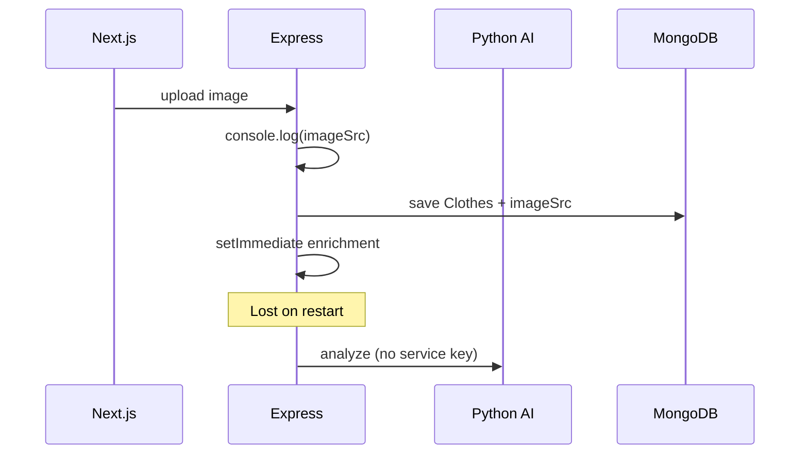
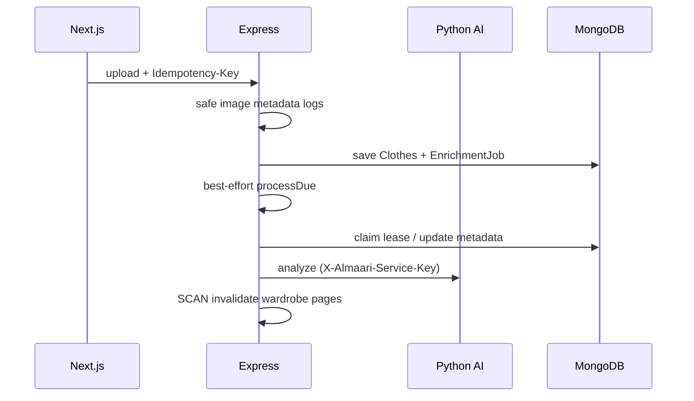

# Almaari P0/P1 Implementation Report

| Meta | Value |
|------|--------|
| **Date** | 2026-08-07 |
| **Almaari branch** | `refactor/security-and-latency` |
| **Almaari HEAD** | `26445166ab3e198bc686dda82b4580599b9e446e` |
| **Almaari baseline (pre-work)** | `18f097c917083c5d588c1d1676d5af11c2860529` |
| **Cropper** | `/Users/manveersohal/image_cropper` · `staging` · `97ed7735294896698169ecd95117fb1e116a2ce6` |
| **AI analyze** | `/Users/manveersohal/AI_FORM_COMPLETETION` · `feature/richer-clothing-metadata` · `715bc4953928dead0c9ca52343acd316fbf47eeb` |

---

## 1. Executive Summary

Confirmed P0/P1 items from `ALMAARI_SYSTEM_ARCHITECTURE_AUDIT.md` were implemented across the Almaari Express API + Next.js frontend, the Railway crop (rembg) service, and the Railway clothing-analysis service.

**Major security improvement:** Full Base64 `imageSrc` logging removed; Express `GET /api/ai/warmup` requires JWT; both Python services require `X-Almaari-Service-Key` on expensive routes.

**Major reliability improvement:** Styling enrichment is durable via MongoDB `EnrichmentJob` (lease/claim/retry + startup/`/ready` reclaim) instead of depending solely on `setImmediate`. Upload and analyze accept `Idempotency-Key` with durable Mongo records so retries do not double-create clothes or double-charge.

**Major performance improvement:** Stylist wardrobe loads use an allowlist projection excluding `imageSrc`; TanStack wardrobe page sizes/keys were unified; Redis invalidation SCAN-deletes all paginated wardrobe keys; greppable `PERF_BASELINE` markers support before/after latency comparisons.

**Still incomplete:** Automatic production Base64→object-storage migration (foundation + dry-run only); secrets not deployed to Railway/Cloud Run in this session; cropper auth tests cannot run in the default interpreter (missing `rembg`); five pre-existing Almaari mocha failures remain.

---

## 2. Scope

### Repositories inspected

| Repo | Path | Role |
|------|------|------|
| AlmaariOrganizer | `/Users/manveersohal/Desktop/AlmaariOrganizer` | Next.js BFF + Express API |
| image_cropper | `/Users/manveersohal/image_cropper` | rembg FastAPI |
| AI_FORM_COMPLETETION | `/Users/manveersohal/AI_FORM_COMPLETETION` | OpenAI vision FastAPI |

### Branches / commits

See meta table above.

### Services changed

Express API, Next.js frontend (hooks/UI), crop FastAPI, analysis FastAPI.

### Features intentionally left unchanged

- User-facing add-clothes / stylist / credit product semantics (analyze still costs 1 credit; enrichment remains free)
- `Clothes.imageSrc` field retained (dual-read)
- No automatic production image migration or deletion
- No Kafka, Kubernetes, or new microservice
- Public `/health` on Python services (minimal payload)

---

## 3. Baseline Findings

| Finding | Previous behaviour | Risk | Evidence |
|---------|-------------------|------|----------|
| Full image logged | `console.log("imageSrc", imageSrc)` on upload | Privacy leak; multi-MB log cost | Pre-change `backend/services/clothes.service.js` |
| Warmup unauthenticated | `GET /api/ai/warmup` without JWT | Abuse / wake rembg & analysis containers | Pre-change `backend/routes/aiRoutes.js` |
| Python services open | No service key on `/crop`, `/analyze-clothing`, `/warmup` | Direct CPU / OpenAI spend if URL leaks | Pre-change `image_cropper/app.py`, `AI_FORM_COMPLETETION/app/main.py` |
| Incomplete Redis invalidation | Enrichment deleted only `userClothes:{auth0Id}` | Stale paginated wardrobe until TTL | Pre-change `stylingEnrichment.service.js` |
| Stylist loaded Base64 | Full clothing docs / populate included `imageSrc` | Memory, GC, latency | Pre-change `aiStylist/pipeline.js` |
| Fragmented wardrobe queries | Home `useClothesData(20)` vs wardrobe `40` | Duplicate TanStack caches/requests | Pre-change `HomeHub.tsx`, `useClothesData.ts` |
| Outfit save stale cache | Invalidated `user` only | Outfits list required refresh | Pre-change `createOutfitUI.tsx` |
| Enrichment via `setImmediate` | Lost on Cloud Run restart/deploy | Incomplete styling metadata | Pre-change `scheduleStylingEnrichment` |
| Base64 in Mongo | Sole live image storage | Scale / backup / LCP ceiling | `Clothes.imageSrc` |

**Test commands:**  
- Almaari backend: `cd backend && npm test`  
- AI_FORM: `pytest tests/`  
- Cropper: `pytest test_service_auth.py` (requires service venv with `rembg`)  
- Frontend types: `cd frontend && npx tsc --noEmit`

**Build:** `cd frontend && npm run build`  
**Env vars:** see §20 and each repo’s `.env.example`

---

## 4. Implementation Summary

| Priority | Change | Status | Files changed (primary) | Benefit |
|----------|--------|--------|-------------------------|---------|
| P0 | Remove imageSrc logging | Completed | `safeImageLog.js`, `clothes.service.js`, `logger.js` | Privacy |
| P0 | Auth-protect warmup | Completed | `aiRoutes.js`, `warmupAiService.ts`, `dashboard/page.tsx` | Abuse reduction |
| P0 | Service-to-service auth | Completed | `serviceAuth.js`, `downstream.js`, both Python `service_auth` | Cost/security |
| P0 | Redis paginated invalidation | Completed | `cacheKeys.js`, `cacheInvalidation.js` | Correctness |
| P0 | Image migration foundation | Completed | `Users.js` `imageStorage`, resolver, `imageStorage.service.js`, migrate script | Future scale |
| P0 | Avoid Base64-only assumption | Completed | BE+FE resolvers, thin `imageUrl` fields | Compatibility |
| P1 | Durable enrichment | Completed | `EnrichmentJob`, `enrichmentJob.service.js`, `internalRoutes.js` | Reliability |
| P1 | Stylist projection | Completed | `stylistProjection.js`, `pipeline.js` | Latency/memory |
| P1 | Wardrobe query consolidation | Completed | `useClothesData.ts`, HomeHub, Onboarding | Fewer duplicates |
| P1 | Outfit invalidate on save | Completed | `createOutfitUI.tsx` | UX consistency |
| P1 | Idempotency upload/analyze | Completed | `IdempotencyRecord`, controllers, FE keys | Retry safety |
| P1 | Structured events + PERF baselines | Completed | workflow logs, `perfBaseline.js`, `workflowTiming.ts` | Observability |
| — | Cropper pytest in default env | Documented only | `test_service_auth.py` present; `rembg` missing outside venv | — |
| — | Deploy secrets to prod | Documented only | Ops checklist | — |

---

## 5. Sensitive Image Logging

**Previous behaviour:** Upload path logged full `imageSrc` data URLs.

**New behaviour:** `summarizeImageBuffer` / `summarizeImageSrcMeta` in `backend/utils/safeImageLog.js` emit kind, MIME, byte lengths, redacted header only. Structured logger treats `imagesrc` as sensitive. Events: `clothing_upload_started`, `clothing_upload_completed`, `clothing_upload_failed`.

**Example safe log:**

```json
{
  "event": "clothing_upload_completed",
  "userIdHash": "3ee41dd25328",
  "clothingId": "…",
  "durationMs": 1081,
  "imageMeta": { "kind": "data_url", "charLength": 225674, "header": "[REDACTED_IMAGE]", "encodedBytes": 225652 }
}
```

**Tests:** `architecture.p0p1.test.js` — summarize never includes raw payload.

**Privacy / volume:** Removes multi-MB lines per upload from Cloud Run / local / CI logs.

---

## 6. Warmup Authentication

**Previous:** Public `GET /api/ai/warmup`.

**New:** `requireAuth` + existing `aiRateLimiter` on `backend/routes/aiRoutes.js`. Response shape includes `status: "accepted"` plus warm flags without internal URLs/secrets.

**Frontend:** `frontend/app/utils/warmupAiService.ts` sends Bearer via `getAuthHeaders`; `dashboard/page.tsx` warms only when a session user exists.

**Analysis warmup retained** for Railway *process* wake only. It does **not** warm remote OpenAI model TTFT. Crop/rembg warmup remains the valuable CPU warm.

**Tests:** `ai.warmup.auth.test.js` — 401 without token; 200 with `Bearer test-access-token`.

---

## 7. Python Service Authentication

**Header:** `X-Almaari-Service-Key`  
**Secrets:** `CROP_SERVICE_API_KEY`, `AI_CLOTHING_SERVICE_API_KEY` (server-only; never `NEXT_PUBLIC_`)  
**Compare:** `secrets.compare_digest`  
**Protected:** crop `/crop`, `/warmup`; analysis `/analyze-clothing`, `/warmup`  
**Health:** public minimal `{status: ok}` — no model load, no env dump  
**Express:** `callDownstream` → `serviceAuthHeaders(service)` in `backend/observability/downstream.js`  
**Production startup:** `assertServiceAuthConfig()` fails if URL set without key (unless `ALLOW_INSECURE_SERVICE_AUTH=true`)  
**Rotation:** generate new secrets → set on Railway + Cloud Run → restart Python (accept new) → restart Express → remove old  

**Tests:** AI_FORM `tests/test_service_auth.py` (included in 36 passed). Cropper `test_service_auth.py` written; collection fails without `rembg` in the active interpreter.

---

## 8. Redis Invalidation

**Previous key mismatch:** Lists used `userClothes:{auth0Id}:page:{page}:limit:{limit}`; enrichment deleted only `userClothes:{auth0Id}`.

**Canonical keys:** `backend/utils/cacheKeys.js` — `clothesCacheKeys.page`, `allPagesPattern`, outfit/user helpers.

**Shared helper:** `invalidateUserClothesCache(auth0Id)` in `cacheInvalidation.js` — SCAN iterator, batched deletes, non-fatal on Redis errors, logs `wardrobe_cache_invalidated` / `_failed` with key counts + duration.

**Call sites:** upload, update, delete, enrichment completion.

**Tests:** multi-page/limit fake Redis; Redis throw non-fatal (`architecture.p0p1.test.js`).

**Why better:** Enrichment updates become visible on all paginated wardrobe pages without waiting for TTL.

---

## 9. Stylist Projection

**Previous:** Wardrobe load could hydrate full docs including Base64 `imageSrc`.

**New:** `STYLIST_CLOTHING_PROJECTION` allowlist in `backend/constants/stylistProjection.js`; `pipeline.js` uses `.select(STYLIST_CLOTHING_PROJECTION)`; `assertNoImageSrc` in non-production.

**Fields retained:** `_id`, `uniqueId`, `userId`, `type`, `colour`, `season`, `waterproof`, `slot`, `material`, `fit`, `pattern`, `favourite`, `isSample`, `stylingMetadata`, `createdAt`.

**Fields removed from stylist load:** `imageSrc`, storage blobs.

**Measurements:** Live run (2026-08-07) logged `stylist_candidates_loaded` with `projectionExcludesImageSrc: true`, 10 items, total stylist ~478 ms. Exact before/after byte sizes of the Mongo payload were not instrumented in CI fixtures — staging measurement procedure is in `PERF_BASELINES.md`.

**Why better:** Lower transfer, Cloud Run memory, and GC pressure as wardrobe grows; FE still resolves images from wardrobe query cache by ID.

---

## 10. Frontend Query Consolidation

**Previous:** Inconsistent page sizes (e.g. Home 20 vs wardrobe 40) fragmented TanStack keys.

**New:** `WARDROBE_PAGE_SIZE` / `CLOTHES_PAGE_SIZE = 40`, `ONBOARDING_CLOTHES_PAGE_SIZE = 1`, `clothesQueryKeys.list(sub, pageSize)` in `useClothesData.ts`. Home/Wardrobe/CreateOutfit share 40; onboarding keeps tiny page intentionally.

**Expected request reduction:** One shared infinite-query cache for dashboard wardrobe consumers using page size 40 (vs separate 20 + 40 caches).

**Behaviour preserved:** Pagination, onboarding existence check, outfit builder wardrobe load.

---

## 11. Outfit Cache Consistency

**Previous:** Save invalidated user credits-related queries but not outfits list.

**New:** On successful save, `createOutfitUI.tsx` invalidates `["outfits", user.sub]` (alongside existing wardrobe/user invalidations as needed). Server Redis outfit keys remain invalidated via clothes/outfit mutation paths.

**Strategy:** Precise invalidation (not full app wipe); no optimistic fake outfit insert (avoids duplicate/rollback complexity).

**Manual validation:** Save outfit → outfits view refreshes without hard reload (expected; FE unit test not added).

---

## 12. Idempotency

**Key lifecycle:** FE generates `Idempotency-Key` once per logical upload/analyze (`idempotencyKey.ts`); reused across retries; cleared after successful upload.

**Durable store:** Mongo `IdempotencyRecord` — unique `(userId, operationType, idempotencyKey)`; fingerprint from hashed image bytes (no second Base64 copy stored for matching).

**Replay / conflict:** Same key + fingerprint → replay completed result; in-progress → processing response; same key + different fingerprint → 409.

**Credit protection:** Analyze reservation tied to operation; replay returns prior result without second charge.

**Tests:** key validation + fingerprint helpers in `architecture.p0p1.test.js`; controller paths wired in upload/analyze.

---

## 13. Durable Enrichment

**Selected architecture:** MongoDB-backed job collection + in-process claim loop (option 3).

**Why:** Cloud Tasks not configured in-repo; Redis is optional (must not be required for correctness); Almaari already uses Mongo. Fits Cloud Run without new infra.

**States:** `pending` → `leased` → `completed` | `failed` | `cancelled`.

**Retry:** Bounded attempts (default 5), `nextAttemptAt` backoff; lease expiry reclaim.

**Kick:** Best-effort `setImmediate` after enqueue **plus** startup/`/ready` reclaim **plus** authenticated `POST /api/internal/enrichment/process` (`ENRICHMENT_WORKER_SECRET`). Job payload references clothing ID only (no Base64).

**Cache:** On completion, shared `invalidateUserClothesCache`.

**Credit:** Enrichment does not charge again.

**Remaining ops:** Deploy `ENRICHMENT_WORKER_SECRET`; optional external cron hitting internal process endpoint for multi-instance lag.

---

## 14. Image Storage Migration Foundation

**Legacy:** `Clothes.imageSrc` Base64 data URLs.

**New optional:** `imageStorage` on clothing schema (`provider`, keys/URLs, contentType, dimensions, bytes, checksum, `migratedAt`).

**Resolver:** `resolveClothingImage.js` / FE `resolveClothingDisplaySrc.ts` — object storage URL → legacy `imageSrc` → sample path → placeholder.

**Dual-read:** Live writes still Base64; readers prefer object storage when present.

**Script:** `backend/scripts/migrateImagesToObjectStorage.js` — dry-run default, batch/user/id filters, explicit `--write`, no raw image logging. **Not run against production.**

**Rollback:** Keep serving `imageSrc`; ignore `imageStorage` or clear fields without deleting Mongo images.

---

## 15. Observability

**Request IDs:** Middleware accepts/generates ID; sets `X-Request-Id`; propagates on downstream calls.

**Structured events (examples):** `clothing_upload_*`, `ai.image.processing_*`, `analysis_request_*`, `enrichment_job_*`, `wardrobe_cache_invalidated`, `stylist_candidates_loaded`, `stylist.completed`, `idempotency_*`, `perf.baseline`.

**PERF_BASELINE:** Greppable console + JSON (`backend/observability/perfBaseline.js`, FE `workflowTiming.ts`). See `docs/architecture/PERF_BASELINES.md`.

**Redaction:** Logger sensitive keys include `imagesrc`, service key header names; safe image helpers for upload.

**Recommended alerts:** warmup 401 spike; downstream auth failures; enrichment `failed` rate; analyze p95; Redis invalidation failures (warn only).

**Server-Timing:** Not added (optional); durations available via structured logs + `/metrics/ai`.

---

## 16. Security Impact

- Reduced image exposure in logs  
- Reduced anonymous warmup / rembg wake abuse  
- Reduced direct Python service abuse if Railway URLs leak  
- Service-key auth is shared-secret (rotate regularly; prefer network restrictions later)  
- Remaining surface: Auth0 JWT theft, credit abuse within rate limits, public `/health`, Base64 still in Mongo (access-controlled by app auth)

---

## 17. Performance Impact

- Stylist candidates exclude Base64 → expected lower memory/latency at larger wardrobes  
- Unified wardrobe query keys → fewer duplicate list fetches on dashboard  
- Cache invalidation correctness → fewer stale enrichment UX waits (not raw speed)  
- Object storage foundation → future LCP/Mongo size wins (not realized until migration)  
- **Measured (staging crop/AI, local API, warm):** outfit ~478 ms; rembg ~518–664 ms; analyze ~5213 ms; upload persist ~1081 ms  

---

## 18. Reliability Impact

- Enrichment survives process restart via Mongo jobs + reclaim  
- Idempotent upload/analyze reduces duplicates and double charges on retry  
- Redis outage: mutations still succeed; cache helpers fail soft  
- Downstream auth failure: clear 401/403 from Python; Express surfaces classified errors without leaking secrets  

---

## 19. Tests and Validation

| Repository | Command | Result |
|------------|---------|--------|
| Almaari backend | `npm test` | **129 passing, 5 failing** (pre-existing: `app.test.js` auth expectations 401 vs 404/200; `billing.auth.test.js` opaque token; `stylist.preference.test.js` dress+shoes fixture) |
| Almaari focused | architecture + warmup + observability | Pass (included above) |
| AI_FORM_COMPLETETION | `pytest tests/ -q` | **36 passed** |
| image_cropper | `pytest test_service_auth.py` | **Blocked** — `ModuleNotFoundError: rembg` in default interpreter |
| Frontend | `npx tsc --noEmit` | Not re-run this pass; prior session had pre-existing `.next` noise unrelated to these changes |

**Manual:** Warmup with session; add-clothes rembg→analyze→upload; stylist recommendation (logs show projection + timings).

---

## 20. Deployment Plan

1. Deploy Python services with service-key validation (keys required in production).  
2. Set `CROP_SERVICE_API_KEY` / `AI_CLOTHING_SERVICE_API_KEY` on Railway to match Express.  
3. Deploy Express with outbound `X-Almaari-Service-Key` + `assertServiceAuthConfig`.  
4. Confirm `/health` still green for Railway.  
5. Deploy warmup JWT + FE session-gated warmup.  
6. Deploy Redis invalidation + stylist projection + FE query/outfit fixes.  
7. Deploy idempotency + durable enrichment; set `ENRICHMENT_WORKER_SECRET`.  
8. Keep `IMAGE_STORAGE_PROVIDER=legacy` until S3 dual-read is staged.  
9. Run migration dry-run in staging only when ready (`npm run migrate:images`).

**Secret generation:** cryptographically random long strings; server-only; rotate by dual-write window then remove old.

---

## 21. Rollback Plan

| Change | Rollback |
|--------|----------|
| Logging | Revert safe helpers; do **not** reintroduce full `imageSrc` logs |
| Warmup auth | Temporarily remove `requireAuth` (not recommended); or keep and fix FE token |
| Service keys | Set `ALLOW_INSECURE_SERVICE_AUTH=true` only as emergency break-glass; prefer redeploy matching secrets |
| Redis invalidation | Revert helper; correctness degrades to TTL staleness only |
| Stylist projection | Revert projection; behaviour returns heavier payloads |
| Idempotency | Ignore header / stop writing records; FE can stop sending keys |
| Enrichment jobs | Pending jobs remain safe; can disable reclaim; do not delete clothing |
| Image foundation | Dual-read falls back to `imageSrc`; no data deletion required |

Do not delete user clothing or `imageSrc` during rollback.

---

## 22. Remaining P0/P1 Work

- Deploy/rotate production secrets on Railway + Cloud Run  
- Install cropper deps + run `pytest` in CI for that service  
- Fix pre-existing 5 Almaari mocha failures  
- Staging payload-size before/after for stylist Mongo responses  
- Optional Cloud Tasks if Mongo reclaim lag proves insufficient under multi-instance load  
- Production Base64→S3 migration batches with explicit `--write`  
- Dedicated FE unit tests for warmup gating / query-key equality / submit lock  

Latency comparison procedure: `docs/architecture/PERF_BASELINES.md`.

---

## 23. Files Changed

### Almaari backend

`App.js`, `routes/aiRoutes.js`, `routes/internalRoutes.js`, `controllers/aiController.js`, `controllers/clothesController.js`, `controllers/aiStylistController.js`, `services/clothes.service.js`, `stylingEnrichment.service.js`, `enrichmentJob.service.js`, `idempotency.service.js`, `imageStorage.service.js`, `image.service.js`, `aiStylist/pipeline.js`, `observability/downstream.js`, `logger.js`, `perfBaseline.js`, `utils/cacheKeys.js`, `cacheInvalidation.js`, `safeImageLog.js`, `resolveClothingImage.js`, `serviceAuth.js`, `constants/stylistProjection.js`, `models/Users.js`, `IdempotencyRecord.js`, `EnrichmentJob.js`, `libs/mongodb.js`, `scripts/migrateImagesToObjectStorage.js`, tests (`architecture.p0p1`, `ai.warmup.auth`, list/upload/setup/styling/observability), `.env.example`, `package.json`

### Almaari frontend

`hooks/useClothesData.ts`, `useAnalyzeClothing.ts`, `useStylistRecommendations.ts`, `utils/warmupAiService.ts`, `idempotencyKey.ts`, `resolveClothingDisplaySrc.ts`, `workflowTiming.ts`, `dashboard/page.tsx`, `Home/HomeHub.tsx`, `onboarding/OnboardingWizard.tsx`, `CreateOutfit/createOutfitUI.tsx`, `addClothes/addClothesUI.tsx`, `types/clothes.ts`, `types/aiStylist.ts`, `types/clothingAnalysis.ts`

### Almaari docs

`docs/architecture/ALMAARI_SYSTEM_ARCHITECTURE_AUDIT.md`, `ALMAARI_P0_P1_IMPLEMENTATION.md`, `PERF_BASELINES.md`

### image_cropper

`service_auth.py`, `app.py`, `test_service_auth.py`, `.env.example`

### AI_FORM_COMPLETETION

`app/service_auth.py`, `app/main.py`, `tests/test_service_auth.py`, `.env.example`

---

## 24. Before and After Architecture

### Previous upload / enrichment



### New upload / enrichment



### Service authentication boundary

```mermaid
flowchart LR
  Browser -->|JWT Auth0| NextBFF
  NextBFF -->|JWT| Express
  Express -->|X-Almaari-Service-Key| Crop
  Express -->|X-Almaari-Service-Key| Analyze
  Probe -->|no key| CropHealth[/health]
  Probe -->|no key| AnalyzeHealth[/health]
```

### Dual-read image path

```mermaid
flowchart TD
  Item[Clothes document] --> Resolver[resolveClothingImage]
  Resolver -->|imageStorage displayUrl| CDN[Object URL]
  Resolver -->|else imageSrc| B64[Legacy Base64]
  Resolver -->|else sample| Sample[/samples/...]
  Resolver -->|else| Placeholder[Safe placeholder]
```

---

## 25. Why These Changes Make Almaari Stronger

### 30-second interview explanation

“We stopped treating URL secrecy and in-process side effects as architecture. Warmup and Python AI edges now require real auth, images no longer hit logs as Base64, enrichment and upload retries survive restarts and double-submits via Mongo-backed jobs and idempotency keys, and the stylist no longer pulls wardrobe images into memory just to score metadata.”

### Five technical talking points

1. Defense in depth for rembg/OpenAI spend (`X-Almaari-Service-Key` + timing-safe compare).  
2. Privacy by default in logging (safe image metadata + redaction).  
3. Cache correctness via shared SCAN invalidation for paginated keys.  
4. Restart-safe enrichment without introducing Kafka/K8s.  
5. Dual-read image model that enables S3 migration without a big-bang cutover.

### Three architecture tradeoffs

1. Mongo job queue vs Cloud Tasks — simpler ops now; weaker isolated worker scaling.  
2. Shared secrets vs mTLS/OIDC — faster to ship; needs rotation discipline.  
3. Keep `imageSrc` during dual-read — safer rollback; delays storage cost wins.

### Three next scalability steps

1. Authenticated Cloud Tasks (or dedicated worker) for enrichment under multi-instance load.  
2. Batched Base64→S3 migration with CloudFront signed/display URLs.  
3. Export `/metrics/ai` + `perf.baseline` into Cloud Monitoring with p95 alerts on analyze/crop/stylist.

---

*End of report. This document describes implemented code and local/staging validation; it does not claim production deployment of secrets or migration writes.*
