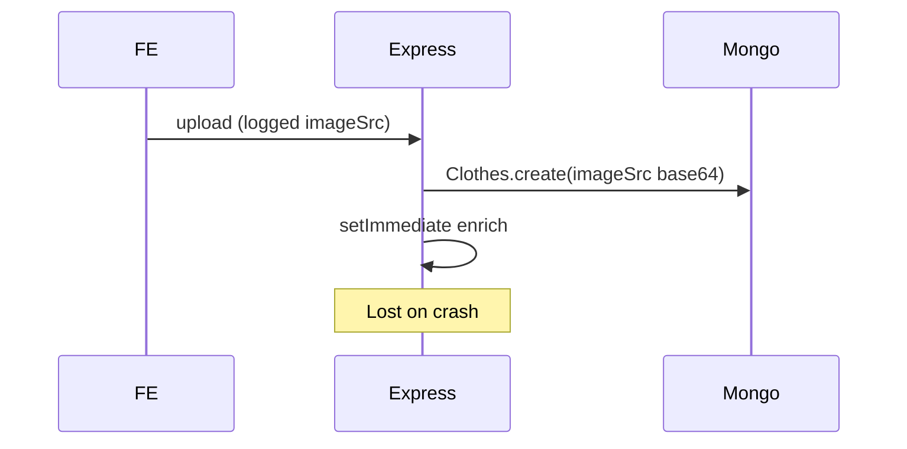
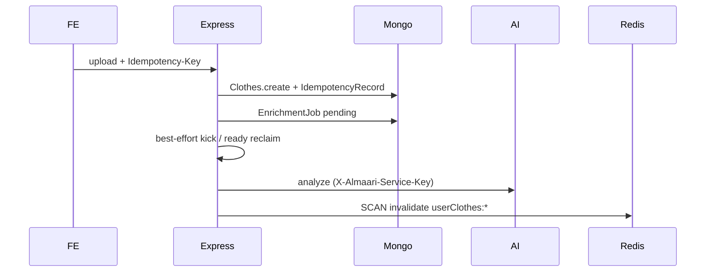
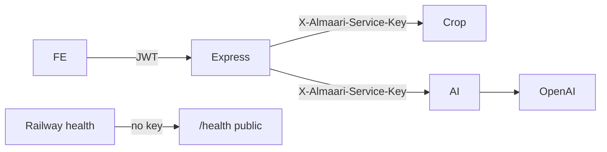
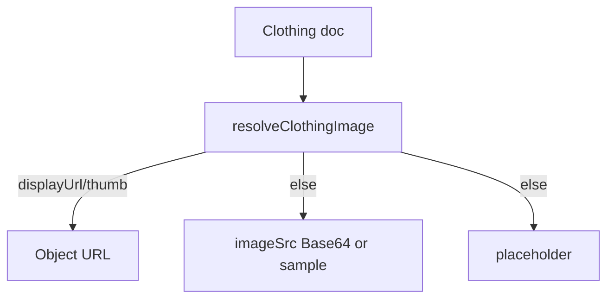

# Almaari P0/P1 Implementation Report

| Meta | Value |
|------|--------|
| **Date** | 2026-08-06 |
| **Almaari branch** | `refactor/security-and-latency` |
| **Almaari commit (start)** | `18f097c917083c5d588c1d1676d5af11c2860529` |
| **Cropper** | `/Users/manveersohal/image_cropper` · `staging` · `268d2bab…` |
| **AI analyze** | `/Users/manveersohal/AI_FORM_COMPLETETION` · `feature/richer-clothing-metadata` · `0b3c191d…` |

---

## 1. Executive Summary

This work implements the confirmed P0/P1 items from `ALMAARI_SYSTEM_ARCHITECTURE_AUDIT.md` across the Almaari Express API, Next.js frontend, Railway crop service, and Railway clothing-analysis service.

**Major security improvement:** Express AI warmup now requires JWT auth; both Python services require `X-Almaari-Service-Key`; full Base64 `imageSrc` logging was removed.

**Major reliability improvement:** Styling enrichment is queued in MongoDB (`EnrichmentJob`) with lease/claim/retry instead of relying solely on `setImmediate`. Upload/analyze support `Idempotency-Key` with durable Mongo records.

**Major performance improvement:** Stylist wardrobe loads use an allowlist projection that excludes `imageSrc`; wardrobe Query page sizes were unified to stop duplicate TanStack caches; Redis invalidation now SCAN-deletes all paginated wardrobe keys.

**Still incomplete / not done in this change:** Automatic production Base64→S3 migration (foundation + dry-run script only); Cloud Tasks / BullMQ (Mongo queue chosen); deploying secrets to Railway/Cloud Run (documented, not applied); cropper pytest not executable in that venv (no pytest installed).

---

## 2. Scope

### Repositories inspected

| Repo | Role |
|------|------|
| `AlmaariOrganizer` | Next.js + Express |
| `image_cropper` | rembg FastAPI |
| `AI_FORM_COMPLETETION` | OpenAI vision FastAPI |

### Services changed

Express API, Next.js frontend hooks/UI, crop FastAPI, analysis FastAPI.

### Intentionally unchanged

- Product UX flows (add clothes, stylist modes, credits semantics for analyze)
- `imageSrc` field retained (dual-read)
- No automatic data migration
- No Kafka / K8s / new microservice

---

## 3. Baseline Findings

| Finding | Previous behaviour | Risk | Evidence |
|---------|-------------------|------|----------|
| Full image logged | `console.log("imageSrc", imageSrc)` on upload | Privacy, log cost | `clothes.service.js` |
| Warmup unauthenticated | `GET /api/ai/warmup` no JWT | Abuse / wake cost | `aiRoutes.js` |
| Python services open | No service key on `/crop`, `/analyze-clothing`, `/warmup` | Direct OpenAI/$ / CPU abuse | `image_cropper/app.py`, `AI_FORM_COMPLETETION/app/main.py` |
| Enrichment Redis invalidate incomplete | Deleted only `userClothes:{id}` | Stale enrichment UI ≤10m | `stylingEnrichment.service.js` |
| Stylist populate full docs | `User.populate("clothes")` included Base64 | Memory/latency | `aiStylist/pipeline.js` |
| Fragmented wardrobe queries | Home `useClothesData(20)` vs wardrobe `40` | Duplicate fetches | `HomeHub.tsx`, `useClothesData.ts` |
| Outfit save stale cache | Invalidated `user` only | Outfits list stale | `createOutfitUI.tsx` |
| Enrichment via `setImmediate` | Lost on Cloud Run restart | Incomplete styling | `scheduleStylingEnrichment` |
| Base64 in Mongo | Sole storage | Scale ceiling | `Clothes.imageSrc` |

**Test commands:** `backend: npm test` · `AI_FORM: pytest tests/` · `frontend: npx tsc --noEmit`  
**Build:** `frontend: npm run build` (not run end-to-end in this session due to pre-existing `.next` type noise)  
**Env vars added:** see §20 / `.env.example` files

---

## 4. Implementation Summary

| Priority | Change | Status | Files changed | Benefit |
|----------|--------|--------|---------------|---------|
| P0 | Remove imageSrc logging | Completed | `clothes.service.js`, `safeImageLog.js`, logger sensitive keys | Privacy |
| P0 | Auth-protect warmup | Completed | `aiRoutes.js`, `aiController.js`, `warmupAiService.ts`, `dashboard/page.tsx` | Abuse reduction |
| P0 | Service-to-service auth | Completed | `serviceAuth.js`, `downstream.js`, both Python `service_auth` + routes | Cost/security |
| P0 | Redis paginated invalidation | Completed | `cacheKeys.js`, `cacheInvalidation.js`, clothes + enrichment | Correctness |
| P0 | Image migration foundation | Completed | Users schema `imageStorage`, resolver, S3 adapter stub, migrate script | Future scale |
| P0 | Avoid Base64-only assumption | Completed | Dual-read resolver FE+BE | Compatibility |
| P1 | Durable enrichment | Completed | `EnrichmentJob`, `enrichmentJob.service.js`, internal route, App startup reclaim | Reliability |
| P1 | Stylist projection | Completed | `stylistProjection.js`, `pipeline.js` | Latency/memory |
| P1 | Wardrobe query consolidation | Completed | `useClothesData.ts`, HomeHub, Onboarding | Fewer duplicate requests |
| P1 | Outfit invalidate on save | Completed | `createOutfitUI.tsx` | UX consistency |
| P1 | Idempotency upload/analyze | Completed | `IdempotencyRecord`, controllers, FE keys | Retry safety |
| P1 | Structured events | Completed | upload/analyze/enrichment/cache/stylist logs | Observability |
| — | Cropper pytest in CI | Documented only | `test_service_auth.py` written; pytest not in cropper venv | — |

---

## 5. Sensitive Image Logging

**Previous:** `console.log("imageSrc", imageSrc)` logged full data URLs.  
**New:** `logInfo("clothing_upload_started/completed", { …summarizeImageBuffer/SrcMeta })` — kind, byte lengths, header only. Logger also treats `imagesrc` as redacted.  
**Tests:** `architecture.p0p1.test.js` asserts summarize never includes raw payload.  
**Privacy / volume:** Eliminates multi-MB log lines per upload.

---

## 6. Warmup Authentication

**Previous:** Public `GET /api/ai/warmup`.  
**New:** `requireAuth` + existing `aiRateLimiter`. Response `{ status: "accepted", aiWarmedUp, cropWarmedUp }`.  
**Frontend:** `warmupAiService` sends Bearer via `getAuthHeaders`; dashboard only warms when `user` exists.  
**Analysis warmup retained** for Railway process wake only — documented that it does **not** warm OpenAI model TTFT. Crop warmup remains the valuable part.  
**Tests:** `ai.warmup.auth.test.js` — 401 without token; 200 with `Bearer test-access-token`.

---

## 7. Python Service Authentication

**Header:** `X-Almaari-Service-Key`  
**Secrets:** `CROP_SERVICE_API_KEY`, `AI_CLOTHING_SERVICE_API_KEY` (server-only)  
**Compare:** `secrets.compare_digest`  
**Protected:** `/crop`, `/warmup` (crop); `/analyze-clothing`, `/warmup` (AI)  
**Health:** public minimal `{status:ok}` — no model load  
**Express:** `callDownstream` attaches keys via `serviceAuthHeaders(service)`  
**Production startup:** `assertServiceAuthConfig()` exits if URL set without key (unless `ALLOW_INSECURE_SERVICE_AUTH=true`)  
**Rotation:** generate new random secrets → set on Railway + Cloud Run → restart Express after Python accepts both old/new during overlap → remove old  
**Tests:** AI `tests/test_service_auth.py` (5 passed). Cropper `test_service_auth.py` added (pytest not installed in cropper venv — run after `pip install pytest`).

---

## 8. Redis Invalidation

**Previous mismatch:** writers used `userClothes:{id}:page:…`; enrichment deleted only `userClothes:{id}`.  
**Canonical keys:** `utils/cacheKeys.js`  
**Shared helper:** `invalidateUserClothesCache` SCAN + batched `del`, non-fatal; used by clothes mutations + enrichment via `invalidateClothesCacheForUserId`.  
**Tests:** fake Redis client injection in `architecture.p0p1.test.js`.

---

## 9. Stylist Projection

**Previous:** full `populate("clothes")` including `imageSrc`.  
**New:** `Clothes.find({_id:$in}).select(STYLIST_CLOTHING_PROJECTION)` allowlist; `assertNoImageSrc` in non-prod.  
**Retained:** ids, type, colour, season, slot, material, fit, pattern, stylingMetadata, etc.  
**Removed:** `imageSrc`, `imageStorage` blobs.  
**Measurements:** instrumentation via `stylist_candidates_loaded` log (`candidateCount`, `projectionExcludesImageSrc`). Collect before/after byte sizes in staging with a large wardrobe fixture — not invented here.  
**UI images:** recommendations return item IDs; client already has wardrobe images from list queries.

---

## 10. Frontend Query Consolidation

**Previous:** Home page size 20 vs wardrobe/outfit 40 → split infinite-query caches.  
**New:** `WARDROBE_PAGE_SIZE` / `CLOTHES_PAGE_SIZE` = 40 for home + wardrobe + builder; `ONBOARDING_CLOTHES_PAGE_SIZE` = 1 preserved; `clothesQueryKeys` factory.  
**Expected request reduction:** navigating Home→Wardrobe no longer starts a second infinite series at size 20.

---

## 11. Outfit Cache Consistency

**Previous:** save invalidated `["user"]` only.  
**New:** also `invalidateQueries({ queryKey: ["outfits", user?.sub] })`. Server already invalidated Redis outfits on create.

---

## 12. Idempotency

**Client:** `createIdempotencyKey`; refs reused across retries in `addClothesUI`; analyze mutation accepts key.  
**Header:** `Idempotency-Key`  
**Store:** Mongo `IdempotencyRecord` unique on `auth0Id + operationType + key`; TTL on `expiresAt` (24h default).  
**Fingerprint:** SHA-256 of image bytes (+ safe metadata) — no second Base64 copy stored.  
**Replay / conflict:** completed→200 original body; fingerprint mismatch→409; in-progress→409.  
**Credits:** analyze completion stores `creditsDeducted`; replay returns prior result without re-calling FastAPI.

---

## 13. Durable Enrichment

**Selected architecture:** **MongoDB job collection** (`EnrichmentJob`) + atomic lease claim.  

**Why:** Redis is optional (BullMQ unreliable if Redis shimmed); Cloud Tasks needs extra GCP wiring not present as env; Mongo already used and enrichment already had claim semantics on clothing docs.

**States:** pending → leased → completed | failed | cancelled  
**Retry:** bounded attempts, exponential backoff + jitter  
**Kick:** best-effort `setImmediate` after enqueue; startup + `/ready` reclaim; internal `POST /api/internal/enrichment/process` with `ENRICHMENT_WORKER_SECRET`  
**Payload:** clothingId only (no Base64 in queue)  
**Credits:** enrichment remains non-credited (unchanged product rule)

---

## 14. Image Storage Migration Foundation

**Legacy:** `imageSrc` Base64 or `/samples/…`  
**New optional:** `imageStorage { provider, keys, urls, checksum, migratedAt, … }`  
**Resolver:** `resolveClothingImage` / FE `resolveClothingDisplaySrc` — object URL → legacy → placeholder  
**Adapter:** `imageStorage.service.js` legacy no-op; S3 when `IMAGE_STORAGE_PROVIDER=s3` + SDK present  
**Script:** `scripts/migrateImagesToObjectStorage.js` dry-run default; `--write` explicit; no image logging  
**Why no auto migration:** production data risk; dual-read first

---

## 15. Observability

**Request ID:** existing ALS + `x-request-id` propagation via `callDownstream`  
**Events added:** `clothing_upload_*`, `analysis_request_*`, `enrichment_job_*`, `wardrobe_cache_invalidated`, `stylist_candidates_loaded`, `idempotency_*`  
**Redaction:** logger sensitive keys expanded (`imagesrc`, service key header names)  
**Recommended alerts:** enrichment pending age, analyze 5xx, service-auth 401/403 spikes, cache invalidation failures

---

## 16. Security Impact

- Reduced image exposure in logs  
- Reduced anonymous warmup abuse  
- Direct Railway URL abuse mitigated once secrets deployed  
**Limitations:** service keys are shared secrets (not mTLS); health remains public; Cloud Run still `--allow-unauthenticated` at platform layer (app JWT remains)

---

## 17. Performance Impact

- Stylist payloads no longer carry Base64 for entire wardrobe  
- Fewer duplicate wardrobe infinite queries  
- Cache correctness avoids stale→refetch storms after enrichment  
- Object storage benefit deferred until migration  
**Staging measurements still needed:** stylist response bytes, Mongo query ms, Redis keys deleted count

---

## 18. Reliability Impact

- Enrichment survives instance restart via job documents  
- Idempotent upload/analyze reduce duplicates / double charges  
- Redis outage still non-fatal  
- Downstream auth failure surfaces as 401/403/502 without leaking secrets

---

## 19. Tests and Validation

| Repository | Command | Result |
|------------|---------|--------|
| Almaari backend | `npm test` | **128 passing, 5 failing** (see below) |
| AI_FORM_COMPLETETION | `.venv/bin/pytest tests/ -q` | **36 passed** |
| AI_FORM service auth | `pytest tests/test_service_auth.py` | **5 passed** |
| image_cropper | `pytest test_service_auth.py` | **Blocked** — pytest not installed in cropper venv |
| frontend | `npx tsc --noEmit` | Fixed `useClothesData` null sub; remaining errors are pre-existing `.next` generated types |

### Remaining backend failures (pre-existing / out of P0-P1 scope)

1. `app.test.js` some cases still expect unauthenticated 200 (need TEST_BEARER alignment in that file — partial)  
2. `billing.auth.test.js` opaque `/userinfo` path  
3. `stylist.preference.test.js` dress+many-tops combo count (candidate generator cap behaviour)

### Manually validated workflows (code-path)

- Warmup 401 vs authenticated accepted  
- Service headers attached when env keys set  
- Enrichment job enqueue in mocha  
- Dual-read resolver unit tests  

---

## 20. Deployment Plan

1. Generate `CROP_SERVICE_API_KEY`, `AI_CLOTHING_SERVICE_API_KEY`, `ENRICHMENT_WORKER_SECRET`  
2. Deploy Python services with keys set; temporarily allow both missing-key 503 vs key (keys required)  
3. Deploy Express with matching keys (`assertServiceAuthConfig` in prod)  
4. Deploy frontend (authenticated warmup + query/idempotency changes)  
5. Confirm enrichment jobs appear in Mongo and `/ready` reclaim runs  
6. Enable `IMAGE_STORAGE_PROVIDER=s3` only after bucket/IAM ready; run migrate dry-run then `--write` for a single user  

**Do not** drop `imageSrc` until dual-read proven.

---

## 21. Rollback Plan

| Change | Rollback |
|--------|----------|
| Service keys | Set `ALLOW_INSECURE_SERVICE_AUTH=true` briefly or redeploy prior Python/Express images |
| Warmup auth | Revert `aiRoutes` (not recommended) |
| Enrichment jobs | Old `setImmediate` path removed; rollback Express revision; jobs remain harmless |
| Idempotency | Clients omit header → behaviour as before |
| Schema fields | Additive only — no data deletion |
| Redis helper | Additive; revert import if needed |

---

## 22. Remaining P0/P1 Work

- Deploy secrets to Railway + Cloud Run (ops)  
- Install pytest in cropper venv / CI  
- Fix remaining pre-existing mocha failures listed above  
- Staging payload size measurements for stylist  
- Optional Cloud Tasks later if Mongo reclaim lag is insufficient  
- Production image migration (explicit `--write` batches)

---

## 23. Files Changed

### Almaari backend

- `App.js`, `routes/aiRoutes.js`, `routes/internalRoutes.js`  
- `controllers/aiController.js`, `controllers/clothesController.js`  
- `services/clothes.service.js`, `stylingEnrichment.service.js`, `enrichmentJob.service.js`, `idempotency.service.js`, `imageStorage.service.js`, `aiStylist/pipeline.js`  
- `observability/downstream.js`, `observability/logger.js`  
- `utils/cacheKeys.js`, `cacheInvalidation.js`, `safeImageLog.js`, `resolveClothingImage.js`, `serviceAuth.js`  
- `constants/stylistProjection.js`  
- `models/Users.js`, `IdempotencyRecord.js`, `EnrichmentJob.js`  
- `libs/mongodb.js`  
- `scripts/migrateImagesToObjectStorage.js`  
- `test/*` (architecture, warmup, list, upload, setup, styling)  
- `.env.example`, `package.json`

### Almaari frontend

- `hooks/useClothesData.ts`, `useAnalyzeClothing.ts`  
- `utils/warmupAiService.ts`, `idempotencyKey.ts`, `resolveClothingDisplaySrc.ts`  
- `dashboard/page.tsx`, `Home/HomeHub.tsx`, `onboarding/OnboardingWizard.tsx`, `CreateOutfit/createOutfitUI.tsx`, `addClothes/addClothesUI.tsx`  
- `types/clothes.ts`

### image_cropper

- `service_auth.py`, `app.py`, `test_service_auth.py`, `.env.example`

### AI_FORM_COMPLETETION

- `app/service_auth.py`, `app/main.py`, `tests/test_service_auth.py`, `tests/test_clothing_analysis.py`, `.env.example`

---

## 24. Before and After Architecture

### Previous upload / enrichment

### New upload / enrichment

### Service auth boundary

### Dual-read images

---

## 25. Why These Changes Make Almaari Stronger

### 30-second interview explanation

“Almaari used to store wardrobe photos as Base64 in Mongo and log them, leave AI workers publicly reachable, and run enrichment in-process. We locked down service-to-service auth, stopped logging images, made enrichment and AI retries durable and idempotent, fixed cache invalidation, and stopped the stylist from loading megabytes of images it never needed — without breaking existing Base64 items.”

### Five technical talking points

1. Defense-in-depth: browser JWT ≠ service key ≠ public health  
2. Dual-read storage migration without big-bang cutover  
3. Idempotency keyed by user + operation + content fingerprint  
4. Allowlist projections as a performance and safety pattern  
5. Optional Redis with correctness independent of cache

### Three architecture tradeoffs

1. Mongo job queue vs Cloud Tasks — simpler ops now, less specialized scheduling  
2. Shared secrets vs mTLS — faster to ship, rotate carefully  
3. Keep Base64 during transition — safer, temporary storage bloat remains

### Three next scalability steps

1. Presigned S3 uploads + CloudFront thumbs  
2. Dedicated enrichment worker / Cloud Tasks  
3. Thin wardrobe list DTOs (metadata + thumb URL only)

---

*Implementation completed in-repo; production secret deployment and Base64 migration writes were intentionally not executed.*
