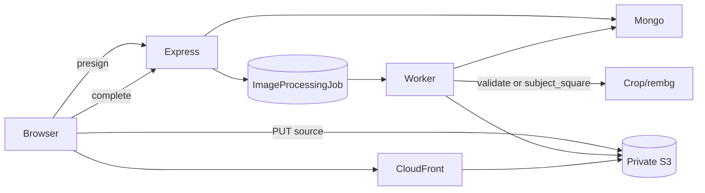
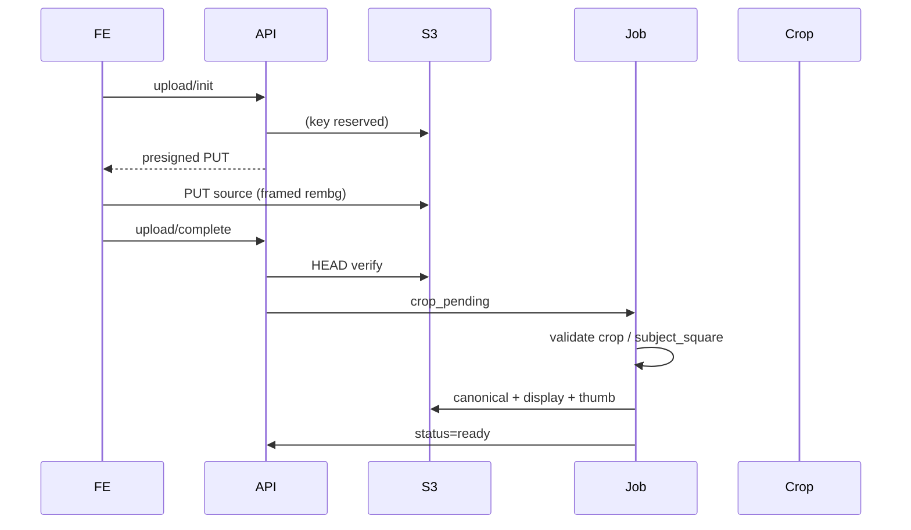

# Almaari P2 Scalability Implementation Report

| Meta | Value |
|------|--------|
| **Date** | 2026-08-07 |
| **Almaari branch** | `refactor/security-and-latency` |
| **Almaari HEAD (pre-P2 tip)** | `45cb0a0` |
| **Cropper** | `staging` (service auth intact; no crop algorithm change) |
| **AI analyze** | `feature/richer-clothing-metadata` (unchanged contract) |

---

## 1. Executive Summary

P2 addresses Almaari’s largest remaining scalability bottleneck: **Base64 clothing images embedded in MongoDB**, while preserving the product invariant that **every new wardrobe image must pass through the canonical crop/rembg pipeline before becoming ready**.

**New architecture (feature-flagged):** Browser → presigned PUT to private S3 → Express HEAD verify → durable image pipeline job → crop validation / server crop → canonical + display + thumbnail WebP on S3 → CloudFront URLs → thin wardrobe DTOs. Legacy Base64 path remains the default until `IMAGE_STORAGE_PROVIDER=s3`.

**Largest performance improvement:** Wardrobe list projection + thin DTO stop shipping Base64 for ready S3 items; stylist still excludes `imageSrc` (P1).

**Largest scalability improvement:** Image bytes leave Express/Mongo request paths for new S3 uploads.

**Largest reliability improvement:** Image pipeline jobs with leases, bounded concurrency, cleanup jobs, and stage reuse for verified canonical objects.

**Migration status:** Dual-read + dry-run migration tooling remain; **no production migration executed**. AWS/CloudFront infrastructure must be provisioned before enabling `s3` mode.

---

## 2. Scope

| Repo | Changed |
|------|---------|
| AlmaariOrganizer | Yes — Express, FE, docs |
| image_cropper | No algorithm change (auth preserved) |
| AI_FORM_COMPLETETION | No change |

**Intentionally unchanged:** Auth0 JWT model, credit rules for analyze, stylist ID safety, rembg visual algorithm (`u2netp` / modes), Redis optionality.

---

## 3. P2 Baseline

| Finding | Previous behaviour | Impact | Evidence |
|---------|-------------------|--------|----------|
| Base64 in Mongo | `Clothes.imageSrc` data URLs | Mongo size, list payload, Cloud Run memory | `Users.js`, `clothes.service.js` |
| Upload via Express body | Multipart → Base64 persist | Proxy bandwidth/memory | `uploadData` |
| List returns full images | `withResolvedImageFields` kept Base64 | Slow wardrobe JSON | `getData` |
| S3 adapter stub | put/get/delete only; no presign | Not production-ready | P0/P1 `imageStorage.service.js` |
| Client rembg then upload | `rembg_only` + frame → `imageAlreadyCropped=true` | Canonical visual = framed rembg | `addClothesUI.tsx` |
| Enrichment only | Metadata jobs, not image pipeline | No durable crop for S3 | `EnrichmentJob` |

**AI analyze input today:** Client-framed rembg PNG (not raw camera). Preserved: analyze still uses framed rembg before upload; S3 pipeline treats framed rembg as `clientCropVerified` source (crop service already ran).

---

## 4. Implementation Summary

| Change | Status | Files | Benefit |
|--------|--------|-------|---------|
| Canonical imageStorage model + states | Completed | `Users.js`, `imageProcessing.js` | Lifecycle clarity |
| Object key factory | Completed | `objectKeyFactory.js` | Safe keys |
| Production S3 adapter + presign | Completed | `imageStorage.service.js` | Direct upload |
| CloudFront/CDN resolver | Completed | `resolveClothingImage.js` | Delivery |
| Upload init/complete APIs | Completed | `directUpload.service.js`, routes | Bypass Express body |
| Mandatory crop pipeline jobs | Completed | `ImageProcessingJob`, `imageProcessingJob.service.js` | Invariant |
| Derivatives (WebP) via sharp | Completed | `derivativeImage.service.js` | Thumb/display |
| Thin wardrobe DTO | Completed | `clothesDto.js`, `getData` | List payload |
| FE direct upload + processing UX | Completed | `directClothesUpload.ts`, `ClothingCard`, `addClothesUI` | UX |
| Deletion → cleanup jobs | Completed | `removeData`, cleanup job type | Orphan hygiene |
| Worker concurrency | Completed | enrichment + image pipeline | Bounded load |
| Migration script crop-aware | Partial | existing migrate script + docs | Safe batches |
| AWS infra provisioned | Infrastructure required | — | Ops |
| Staging byte benchmarks | Documented only | PERF_BASELINES | Need S3 env |
| Cropper pytest rembg env | Documented only | — | Venv |

---

## 5. Previous Image Architecture


Why it does not scale: document size, serialization cost, Redis cache bloat, Cloud Run request memory, no CDN edge caching of images.

---

## 6. New Image Architecture



Ready is impossible until canonical crop is validated and derivatives exist.

---

## 7. The Canonical Image Invariant

**ADR — All Clothing Images Require Canonical Crop Processing**

**Decision:** All Almaari clothing images must pass through the approved crop/background-removal process before they are considered ready.

**Rationale:** Uniform wardrobe visuals, remove background clutter, consistent AI inputs, smaller derivatives, separate upload format from display format.

**Consequence:** Crop is on the critical path — durable retries, auth, monitoring, idempotency, failure states, capacity planning. The system must not silently display uncropped source as ready.

**Current product mapping:**
- **Legacy / default:** Client calls crop service (`rembg_only`) + user frame → upload with `imageAlreadyCropped=true`. Server crop runs if flag false.
- **S3 mode:** Uploaded source is the framed rembg blob with `clientCropVerified=true`. Pipeline **validates** crop output (does not silently accept empty/invalid). If not client-verified, pipeline runs `subject_square`.
- **Never:** Mark `ready` using uncropped source as wardrobe display.



---

## 8. Storage Model

| Variant | Role | Key pattern |
|---------|------|-------------|
| source | Processing input / recovery | `users/{userId}/clothing/{id}/source/{hash}.ext` |
| canonical | Cropped garment authority | `.../canonical/v{n}.png` |
| display | Detail / outfit UI | `.../display/v{n}.webp` |
| thumbnail | Grid cards | `.../thumbnail/v{n}.webp` |

**Source retention recommendation:** **Retain source** until migration and crop pipeline are proven in staging/production. Improves recrop/recovery; accept storage + privacy cost temporarily. Revisit deletion after verification window.

---

## 9. Presigned Upload Flow

`POST /api/clothes/upload/init` → JWT + rate limit + MIME/size + idempotency → clothing shell `upload_pending` → presigned PUT.  
`POST /api/clothes/upload/complete` → HEAD verify → `crop_pending` → enqueue pipeline.  
Never returns AWS credentials. Presigned query strings are not logged.

---

## 10. CloudFront Architecture

- Private S3 origin (expected OAC/OAI — ops).
- `IMAGE_CDN_BASE_URL` or `AWS_CLOUDFRONT_DOMAIN` → `getPublicDeliveryUrl(key)`.
- Versioned keys (`v{n}`) for cache busting; `Cache-Control: immutable` on put.
- Prefer new keys over CloudFront invalidations.

---

## 11. Canonical Crop and Derivative Pipeline

Stages: verify source → crop/validate → canonical upload → sharp WebP display/thumb → Mongo `ready` → Redis invalidate → schedule styling enrichment (separate).  
Crop failure → `crop_failed`, no AI analyze in this pipeline, no source-as-display.

---

## 12. Wardrobe DTO Redesign

**Before:** Full lean docs + resolved `imageSrc` (often multi-100KB Base64).  
**After:** `WARDROBE_LIST_PROJECTION` + `toWardrobeListItem` — card fields + `thumbnailUrl` / `imageStatus` / `processingStatus`. Ready S3 items never include Base64.

**Measured list payload (legacy still default):** Not re-benchmarked against live S3 (infra not provisioned). Instrumentation: thin DTO in place; compare `Content-Length` on `/api/clothes/listClothes` before/after enabling S3 for a test user (document in PERF_BASELINES).

---

## 13. Frontend Image Architecture

- `tryDirectClothesUpload` with multipart fallback when `OBJECT_STORAGE_DISABLED`.
- `ClothingCard` uses `resolveClothingDisplaySrc`; shows “Removing background…” / “Crop failed”.
- Next.js `images.remotePatterns` for CloudFront / CDN hosts; data URLs/`/samples` unoptimized per card.
- Legacy Base64 cards unchanged.

---

## 14. Migration Strategy

- Dual-read remains.
- Dry-run default (`npm run migrate:images`).
- Migration must produce **canonical crop**, not source-only completeness.
- Do **not** delete `imageSrc` in this phase.
- Future: `--remove-legacy-base64` only after verified window.

**Legacy classification limitation:** Existing Base64 from current product is typically already framed rembg (`already_cropped`). Unknown historical rows should be treated as `requires_crop` unless evidence says otherwise.

---

## 15. Deletion and Cleanup

Clothing delete removes Mongo first, then enqueues `ImageProcessingJob` `cleanup` with collected keys. Missing S3 objects count as success. Abandoned `upload_pending` objects: reclaim via future TTL sweep (documented limitation).

---

## 16. Worker Hardening

- Separate `ImageProcessingJob` from styling `EnrichmentJob`.
- Bounded concurrency (`ENRICHMENT_WORKER_CONCURRENCY`, default 2).
- Lease MS configurable; renew during long pipeline.
- Startup + `/ready` + `POST /api/internal/images/process`.
- Reuse existing canonical if HEAD exists.
- Graceful: interrupted jobs stay `leased` until expiry reclaim (Cloud Run SIGTERM best-effort; full drain not implemented).

---

## 17. Idempotency

Init uses `clothing_upload` idempotency; complete is idempotent for statuses past upload. Same logical upload → same clothing ID + source key + pipeline job. Crop not re-run if canonical exists. Analyze credits unchanged (pipeline does not charge; client analyze remains credit-metered).

---

## 18. Security Impact

Private bucket assumption, short-lived PUT, server-chosen keys, HEAD verification, no arbitrary browser paths, CDN URLs from keys, no presigned query logging, service keys for crop unchanged. Source never public wardrobe asset.

---

## 19. Reliability Impact

Partial PUT → complete retries; crop retries with backoff; terminal `crop_failed`; Redis optional; Mongo job durability.

---

## 20. Scalability Impact

Express horizontal scale without image bodies (S3 mode); smaller Mongo docs post-migration; smaller Redis list cache; CDN edge delivery; crop isolated in worker + Railway.

---

## 21. Performance Results

| Workflow | Before | After | Change | Environment |
|----------|--------|-------|--------|-------------|
| Outfit recommendation | ~478 ms | unchanged (P1 projection) | — | local+staging AI (P0/P1) |
| Analyze | ~5213 ms | unchanged | — | same |
| rembg | ~518–664 ms | unchanged | — | same |
| Upload persist (legacy) | ~1081 ms | unchanged default | — | same |
| Wardrobe list bytes (S3 ready) | Base64-heavy | thin DTO | **expected ↓** | not measured (no S3 env) |
| Direct upload client | n/a | new path | — | needs AWS |

Do not invent S3 latency numbers. Capture when staging bucket is available via `PERF_BASELINE` + `clothing_image_pipeline`.

---

## 22. Region and Network Analysis

| Component | Platform | Region | Evidence | Changeable? |
|-----------|----------|--------|----------|-------------|
| Frontend | Vercel | Not confirmed in-repo | deploy platform | Yes |
| API | Cloud Run | Not confirmed in-repo | prior audit | Yes |
| MongoDB | Atlas | Not confirmed | URI host | Yes |
| Redis | Upstash/other | Optional | env | Yes |
| S3 | AWS | `AWS_REGION` env | config | Yes |
| CloudFront | AWS | global edge | config | Yes |
| Crop / AI | Railway | Not confirmed | staging URLs | Limited |

**Recommendation:** Colocate Express + Mongo + S3 region; place crop near backend when possible. No automatic min-instances change (cost unknown).

---

## 23. Infrastructure Configuration

Required to enable S3 mode:

```
IMAGE_STORAGE_PROVIDER=s3
AWS_REGION=
AWS_S3_BUCKET=
IMAGE_CDN_BASE_URL=
# Prefer IAM role over static keys
S3_UPLOAD_URL_TTL_SECONDS=900
ENRICHMENT_WORKER_CONCURRENCY=2
IMAGE_PIPELINE_LEASE_MS=600000
ENRICHMENT_WORKER_SECRET=
```

Bucket: block public access; CloudFront OAC; least-privilege IAM; no browser listing.

---

## 24. Tests

| Repository | Command | Result |
|------------|---------|--------|
| Almaari backend | `npm test` | **138 passing, 5 failing** (same pre-existing 5) |
| Almaari P2 focused | `mocha test/architecture.p2.test.js --exit` | **9 passing** |
| AI_FORM | not re-run this phase | prior 36 pass |
| Cropper | rembg missing in default Python | blocked |

---

## 25. P0/P1 Validation Follow-Up

| Test | Root cause | P2 relevant? | Action |
|------|------------|--------------|--------|
| `app.test.js` 401 vs 404/200 | Stale tests without JWT | No | Document |
| `billing.auth.test.js` opaque token | Config/expectation drift | No | Document |
| `stylist.preference` dress+shoes | Fixture/scoring | No | Document |
| Cropper pytest | Missing rembg in interpreter | Partial | Use service venv |
| Frontend clean build | Not run this session | Partial | Recommended before Stage 3 |

---

## 26. Deployment Plan

0. Provision S3 + CloudFront + IAM  
1. Deploy dual-read + thin DTO (legacy default)  
2. Staging `IMAGE_STORAGE_PROVIDER=s3` for test users  
3. Monitor crop failure / pipeline metrics  
4. Enable for new uploads  
5. Controlled migration dry-run → batches  
6. Legacy Base64 removal — later, explicit  

---

## 27. Rollback Plan

- Set `IMAGE_STORAGE_PROVIDER=legacy` for new uploads  
- Keep dual-read for existing S3 records  
- Do not delete `imageStorage` metadata  
- CDN issues → temporary signed GET (adapter already supports)  
- Crop failures → `crop_failed` UI, retry job — never source-as-ready  

---

## 28. Remaining Limitations

- AWS/CloudFront not provisioned in this session  
- Default mode still legacy Base64  
- Migration not crop-enforced in script beyond docs (operator must use pipeline)  
- Abandoned upload TTL sweeper not fully automated  
- Full SIGTERM drain not implemented  
- Staging byte benchmarks pending S3  
- Source retained (privacy/cost tradeoff)  

---

## 29. Next Architecture Priorities

1. Provision staging S3/CDN and measure list/upload baselines  
2. First-class processing status polling UI  
3. Harden migration CLI to always enqueue image pipeline  
4. Cloud Tasks if Mongo reclaim lag appears  
5. Schema cleanup after Base64 removal window  

---

## 30. Technical Interview Explanation

**30-second:** Almaari is moving images out of Mongo: browsers upload to private S3, a worker enforces rembg/crop before ready, and CloudFront serves WebP derivatives—while old Base64 items still work.

**2-minute:** Base64-in-Mongo crushed list payloads and Cloud Run memory. P2 adds presigned uploads, HEAD verification, durable crop pipeline jobs, canonical/display/thumbnail objects, thin DTOs, and dual-read migration. Crop is mandatory: ready requires validated canonical crop. Client rembg+frame remains the product visual; S3 mode validates that crop rather than displaying raw uploads.

**Five talking points:** (1) Mandatory crop ADR (2) Presigned PUT + HEAD (3) Thin list DTO (4) Dual-read safety (5) Bounded worker concurrency  

**Three tradeoffs:** Dual-read vs cleanup; Mongo jobs vs Cloud Tasks; retain source vs privacy; client rembg vs second server rembg (avoided when verified).

---

*End of P2 report. Infrastructure enablement and production migration are ops follow-ups.*
