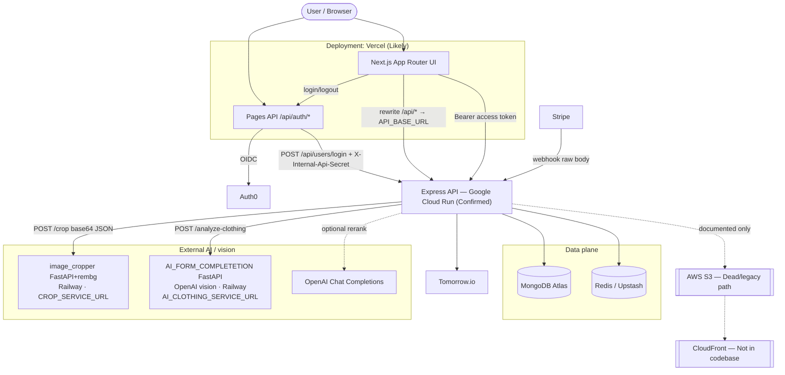
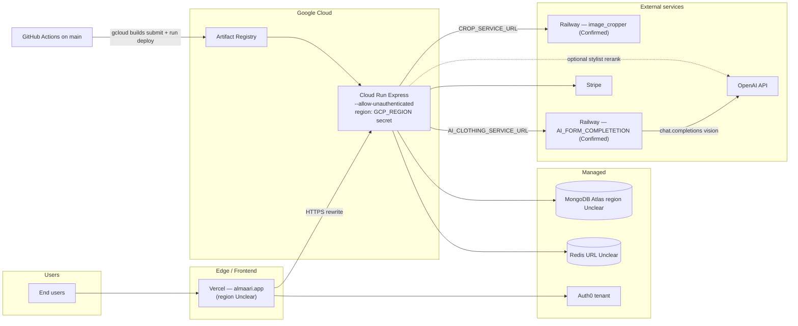
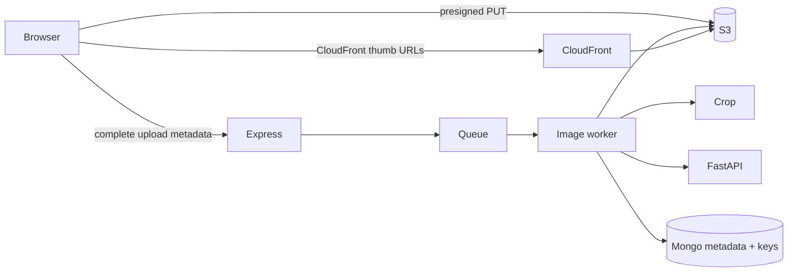
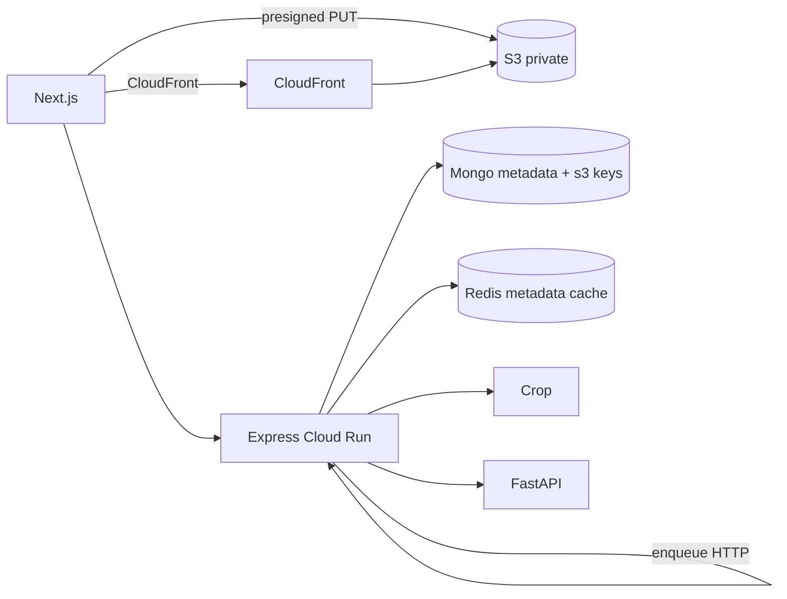
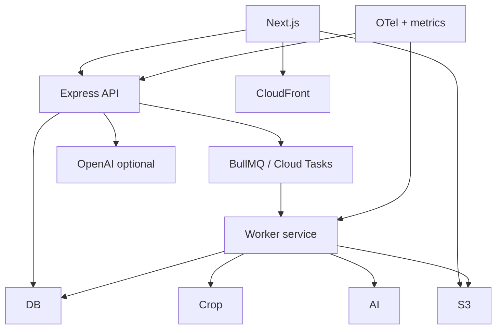

# Almaari System Architecture & Performance Audit

| Meta | Value |
|------|--------|
| **Date of analysis** | 2026-08-06 (crop + AI analyze addenda same day) |
| **Branch analyzed** | Almaari: `feature/UI/UX` · Cropper: `staging` · AI analyze: `feature/richer-clothing-metadata` |
| **Commit** | Almaari: `18f097c9…` · Cropper: `268d2bab…` · AI: `0b3c191d7e6ecf37dcf9b48e15820792e0925288` |
| **Analyst role** | Principal System Architect / Staff Backend / SRE (read-only audit) |
| **Confidence** | **High** for Almaari, **crop** (`image_cropper`), and **clothing analyze** (`AI_FORM_COMPLETETION`). **Medium** for live regions, Railway/Cloud Run instance sizes, and whether production `OPENAI_MODEL` differs from default. |

### Directories inspected

| Path | Status |
|------|--------|
| `backend/` | Fully inspected |
| `frontend/` | Fully inspected |
| `docs/` | Inspected vs implementation |
| `docker-compose.yml`, `.github/workflows/` | Inspected |
| Almaari `image-cropper/` | Empty placeholder |
| `/Users/manveersohal/image_cropper/` | **Confirmed** crop service (FastAPI + rembg, Railway) |
| `/Users/manveersohal/AI_FORM_COMPLETETION/` | **Confirmed** clothing analyze service (FastAPI + OpenAI vision, Railway) |
| Root `package.json` | Not primary runtime |

### Areas that could not be verified

- Live production env values / regions / Railway sleep policies / instance sizes (do not read committed `.env` secrets in reports)
- Whether production `OPENAI_MODEL` is overridden from `gpt-4o-mini`
- Exact OpenAI vision token/cost accounting in prod dashboards
- Netlify vs Vercel for frontend hosting beyond config hints
- Cloud Run CPU/memory/concurrency settings beyond the deploy workflow

---

## 1. Executive summary

Almaari is best classified as a **hybrid modular monolith**: a Next.js BFF/UI on Vercel, an Express product API on Google Cloud Run, MongoDB Atlas for durable state, optional Redis for list caching, and **two external Python HTTP services** for crop/background-removal and vision tagging. Outfit recommendation is a **deterministic combinatorial stylist** with an **optional OpenAI rerank**.

The most important discrepancy between docs/README and the live path:

> **Confirmed:** Clothing images are stored as **base64 data URLs in MongoDB** (`Clothes.imageSrc`). AWS S3 and CloudFront are **documented / prototyped**, not wired into Express services. Evidence: `backend/services/clothes.service.js` `uploadData` → `toBase64` → `Clothes.create({ imageSrc })`; no S3 SDK imports in the service layer; `docs/image-pipeline-s3.md` describes an *intended* presigned design; `backend/s3-test.js` is a standalone orphan script.

This single design choice dominates latency, cost, scalability, and reliability risk: every wardrobe list, outfit populate, and stylist load can ferry megabytes of base64 through Redis, Cloud Run, Next rewrites, and the browser.

**Strongest engineering:** Auth0 JWT ownership model, credit reserve/refund around AI, structured AI observability, hybrid stylist pipeline that never invents clothing IDs, magic-byte upload validation, client rembg→crop→analyze UX, cropper rembg diagnostics + baked `u2netp`, and the analyze service’s **prompt discipline + normalization layer + pytest contract tests** (`AI_FORM_COMPLETETION`).

**Largest risks:** base64-in-Mongo, in-process `setImmediate` enrichment (lost on crash/scale), enrichment Redis invalidation missing paginated keys, unauthenticated warmups that can wake expensive workers, and full-wardrobe populate including images for stylist requests.

---

## 2. Repository and runtime map

### Component responsibility table

| Component | Runtime | Entry point | Responsibility | Deployment target | Stateful? | Evidence |
|-----------|---------|-------------|----------------|-------------------|-----------|----------|
| Next.js frontend | Node (Next 16) | `frontend` `next dev` / `next start`; App Router under `frontend/app` | UI, Auth0 session, BFF rewrites to API | **Likely Vercel** (`next.config.ts` comments; `almaari.app` redirects); Docker Compose for local | Stateless (session cookies via Auth0) | `frontend/package.json`, `frontend/next.config.ts` |
| Auth0 Pages API | Next Pages Router | `frontend/pages/api/auth/[...auth0].ts`, `access-token.ts` | Login/callback/logout; mint API access token; bootstrap user | Same as frontend host | Session cookies | `@auth0/nextjs-auth0`; `lib/syncUserBootstrap.ts` |
| Express API | Node 20 | `backend/server.js` → `backend/App.js` | Wardrobe CRUD, authZ, credits, billing webhook, AI orchestration, stylist | **Google Cloud Run** via `.github/workflows/docker-image.yml` | Stateless process; state in Mongo/Redis | `CMD node server.js`; Cloud Run deploy |
| MongoDB | Atlas (prod) / optional local container | `backend/libs/mongodb.js` | Users, clothes, outfits, purchases, feedback | Atlas (compose profile `local-db` optional) | **Yes** | `MONGODB_URI`; models in `backend/models/` |
| Redis | Upstash or compatible | `backend/libs/redis.client.js` | Optional clothes/outfits/userId cache | External Redis URL | **Yes** (cache) | `REDIS_URL`; shim if missing |
| Crop service | Python 3.11 + FastAPI + rembg | `/Users/manveersohal/image_cropper/app.py` (`uvicorn app:app`) | Background removal + optional square pad; base64 in/out | **Railway** (`railway.toml` + Dockerfile) | Process-local rembg session / U2Net weights | `app.py`, `Dockerfile`, Express `image.service.js` |
| AI clothing service | Python 3.11 + FastAPI + OpenAI SDK | `/Users/manveersohal/AI_FORM_COMPLETETION/app/main.py` | Vision tagging via OpenAI (`gpt-4o-mini` default) + normalization | **Railway** (`railway.toml`) | Stateless (OpenAI client singleton) | `clothing_analysis.py`, Express `aiClothing.service.js` |
| OpenAI | SaaS | `observability/openaiInstrumented.js` | Optional stylist rerank only | OpenAI API | N/A | `aiStylist/reranker.js` |
| Stripe | SaaS | `billing.service.js` + webhook in `App.js` | Credit purchases | Stripe | N/A | webhook raw body path |
| Tomorrow.io | SaaS | weather controller/service | Weather for stylist context | External | N/A | `TOMORROW_API_KEY` |
| Auth0 | SaaS | JWKS verify in `verifyAuth0Jwt.js` | Identity provider | Auth0 tenant | N/A | `AUTH0_DOMAIN`, `AUTH0_AUDIENCE` |
| AWS S3 | **Not active** | Orphan `s3-test.js` | Intended object storage | N/A in live path | — | No service imports; docs say “intended” |
| CloudFront | **Not present** | — | — | — | — | Zero backend JS references |
| Almaari `image-cropper/` | **Dead placeholder** | Empty dir in monorepo | Not deployed | — | — | Empty; live code is sibling repo `image_cropper` |
| Root `package.json` | Not primary runtime | — | Accidental dep dump | — | — | Separate from `backend`/`frontend` packages |

### Likely production request path (Confirmed / Likely)

```
Browser → Vercel (Next.js almaari.app)
  → /api/auth/* stays on Vercel (Auth0)
  → /api/{clothes,users,ai,...}/* rewritten to Cloud Run Express
      → MongoDB Atlas
      → Redis (optional)
      → Crop / FastAPI URLs (external)
      → OpenAI (optional stylist)
      → Stripe webhooks hit Express directly
```

Evidence: `frontend/next.config.ts` rewrites; CI deploys **only** `./backend` to Cloud Run; frontend has no production Dockerfile (only `Dockerfile.dev`).

---

## 3. Current architecture classification

**Primary:** Hybrid **modular monolith + specialized external services**, **request–response** with **in-process background work** (`setImmediate`).

| Style | Fits? | Why |
|-------|-------|-----|
| Modular monolith | **Yes (core)** | Wardrobe, users, billing, stylist, credits live in one Express process |
| Microservices | **Partial** | Only crop + vision tagging are separate HTTP services; not independently versioned in this repo |
| Serverless | **Partial (edge)** | Next on Vercel; Express on Cloud Run (container, can scale to zero → cold starts) |
| Event-driven | **No** | No durable queue/bus |
| Distributed monolith | **Risk if scaled naively** | Shared Mongo + in-process jobs + base64 payloads couple services operationally |

### Why it likely evolved this way

1. Start with Express + Mongo for product velocity.
2. Move CPU-heavy rembg/vision off Node onto Python services (correct isolation).
3. Keep orchestration, credits, and auth in Express (correct control plane).
4. Document S3 before wiring it; ship with base64-in-Mongo for MVP speed.
5. Add Redis for list caching after pagination pain (`docs/pagination-performance.md`).
6. Build stylist as rules first, OpenAI rerank optional (`OPENAI_API_KEY` may be unset).

### Clean separations

- Auth session (Next) vs API JWT validation (Express)
- Credit metering + refund (Express) vs inference (FastAPI)
- Deterministic stylist candidates vs optional LLM rerank
- Stripe webhook fulfillment vs client redirects

### Duplicated / tightly coupled

- Metadata enums duplicated across Node constants, FastAPI contract docs, and frontend validators
- Crop called from **client path** (`/api/clothes/crop`) and **server upload path** (`cropImage` in `uploadData`)
- Redis invalidation logic duplicated incompletely (`invalidateUserClothesCache` vs enrichment’s `redis.del("userClothes:"+id)`)
- README architecture still draws S3 as active

### Strengths

Stylist ID-safety, credit accounting, upload MIME magic bytes, observability for AI hops, client-side image downscale before rembg/analyze.

### Growth friction

Base64 documents, no durable jobs, Cloud Run memory under concurrent uploads, stylist full populate, Redis caching large JSON blobs.

---

## 4. Current architecture diagram

Solid arrows = **Confirmed** communication. Dashed = **Likely / intended / unused**.



---

## 5. Deployment diagram



**Region mismatch risk (Unclear but important):** Vercel → Cloud Run → Railway (crop) and Railway (analyze) → OpenAI can stack 3–4 network hops. Colocate Cloud Run + both Railway services + Atlas/Redis in one region when possible. Measure with Server-Timing / downstream logs.

**Local compose:** `docker-compose.yml` runs `api` + `frontend` on `almaari-app` network; Mongo only with `--profile local-db`. Ports map `3000` (FE) and `3001:3001` for API (note: Express default listen is `8080` — **Likely** env sets `PORT=3001` in `.env`; mismatch would break local proxy if unset).

---

## 6. End-to-end workflow traces

### Flow A: Authentication

| Step | What happens | Evidence |
|------|----------------|----------|
| 1. Login | Browser navigates to `/api/auth/login` | Dashboard / `LoginButton` |
| 2. Auth0 | OIDC hosted login | `@auth0/nextjs-auth0` `handleAuth` |
| 3. Callback | `afterCallback` calls `syncUserOnLogin` | `pages/api/auth/[...auth0].ts`, `lib/syncUserBootstrap.ts` |
| 4. Bootstrap | Next **server** `POST {API}/api/users/login` with `X-Internal-Api-Secret` + `{ auth0Id, email }` | `requireInternalApiSecret`, `userBootstrap.service.js` `findOrCreateUserByAuth0Id` |
| 5. Session | Auth0 session cookie on Next host | Auth0 SDK |
| 6. API calls | Client `getAuthHeaders()` → `/api/auth/access-token` → Bearer JWT for `AUTH0_AUDIENCE` | `getAuthHeaders.ts`; in-memory cache + single-flight |
| 7. API authZ | `requireAuth` → `authenticateBearerToken` → `verifyAuth0Jwt` (JWKS RSA) | Sets `req.auth.sub` — **never trust client auth0Id** (comment in middleware) |
| 8. Isolation | Clothes queries scoped by `userId` / ownership checks against `auth0Id` | `clothes.service.js` |

**Frontend page protection:** No Next `middleware.ts` / `withPageAuthRequired`. Dashboard shows login CTA if `useUser()` empty — **client gate only**. Admin uses `useRole()` redirect.

**Failure:** If bootstrap fails (missing secret/email), Auth0 session can exist without Mongo user → later 404 User Not Found.

### Flow B: Clothing image upload

**Trigger:** Dashboard `view=addClothes` → `AddClothesUI`.

| Stage | Service | Function / endpoint | Sync/async | External? | Failure behavior | Likely latency |
|-------|---------|---------------------|------------|-----------|------------------|----------------|
| Pick/capture | Browser | `CameraCapture` / file picker | Sync | No | User retry | <100ms–2s |
| Downscale | Browser | `createWorkingImageBlob` (max edge 640) | Sync | No | Fallback | 50–300ms |
| rembg | Express→Crop | `POST /api/clothes/crop` mode `rembg_only` | Sync await | Crop | Error; user can proceed carefully | 1–8s (+cold start) |
| User crop | Browser | `react-easy-crop` + `getCroppedClothingBlob` | Sync | No | — | interactive |
| Analyze | Express→FastAPI | `POST /api/ai/analyze-clothing` | Sync | FastAPI | Credit refund; form still editable | 2–20s (+cold) |
| Persist | Express | `POST /api/clothes/upload` FormData, `imageAlreadyCropped=true` | Sync | Maybe crop if flag false | 500 on crop fail | 200ms–3s |
| Enrich | Express in-process | `scheduleStylingEnrichment` → `setImmediate` | Async fire-forget | FastAPI if no rich snapshot | Status failed/stale reclaim | background |
| Cache | Redis | `invalidateUserClothesCache` | Sync best-effort | Redis | Warn; stale until TTL | <50ms |
| Render | Browser | `next/image` / img with `imageSrc` data URL or `/samples/...` | — | No | Broken image | — |

**Where variants live (Confirmed):**

| Variant | Storage |
|---------|---------|
| Original camera/file | Browser only (not retained server-side after upload) |
| Working 640px PNG | Browser memory |
| rembg transparent | Browser blob; also sent as upload buffer |
| Final catalog image | **MongoDB `Clothes.imageSrc` as `data:image/png;base64,...`** |
| Thumbnails / WebP / AVIF | **Not generated** |
| S3 originals | **Not used** |

#### Clothing upload sequence diagram

```mermaid
sequenceDiagram
  participant U as User
  participant FE as Next.js AddClothesUI
  participant NX as Next rewrite
  participant API as Express Cloud Run
  participant Crop as Crop service
  participant AI as FastAPI analyze
  participant DB as MongoDB
  participant R as Redis

  U->>FE: Select / capture photo
  FE->>FE: Downscale to ≤640px PNG
  FE->>NX: POST /api/clothes/crop (multipart)
  NX->>API: proxy + Bearer JWT
  API->>API: multer + magic-byte validate
  API->>Crop: POST /crop {image, mode:rembg_only}
  Crop-->>API: transparent PNG base64
  API-->>FE: cropped image
  FE->>FE: User frames crop
  FE->>NX: POST /api/ai/analyze-clothing
  NX->>API: JWT + image data URL
  API->>API: deductOneCredit
  API->>AI: POST /analyze-clothing
  AI-->>API: tags + confidences
  API->>API: normalize; refund if empty
  API-->>FE: tags + creditBalance
  U->>FE: Confirm metadata / save
  FE->>NX: POST /api/clothes/upload (cropped PNG + fields + analysisSnapshot)
  NX->>API: JWT multipart
  API->>API: toBase64 (skip crop if imageAlreadyCropped)
  API->>DB: Clothes.create + User.$push
  API->>R: invalidate userClothes:* keys
  API->>API: applyAiStylingEnrichment or setImmediate enrich
  API-->>FE: clothing doc
  FE->>FE: invalidate TanStack clothesData + user
```

**Estimated network hops (save path after local prep):** Browser → Vercel → Cloud Run → Mongo (+ Redis) → response → Vercel → Browser ≈ **2–4 RTTs** plus optional crop/analyze earlier.

### Flow C: AI clothing analysis

| Concern | Finding | Evidence |
|---------|---------|----------|
| Prompt / model | **Confirmed:** inline `SYSTEM_PROMPT` in FastAPI; OpenAI Chat Completions vision; default `gpt-4o-mini` (`OPENAI_MODEL`) | `AI_FORM_COMPLETETION/app/services/clothing_analysis.py`, `openai_client.py` |
| Input | Base64 (raw or data URL); re-wrapped as `data:image/jpeg;base64,...` for OpenAI | `strip_data_url`, `analyze_clothing_image` |
| Output schema | Core + rich `{value,confidence}` + `validTagCount`; **no `subtype` emitted** (Node still accepts optional subtype) | `schemas.py`; Node `normalizeClothingAnalysisResponse.js` |
| Sync | Express awaits FastAPI; FastAPI `async` route calls **sync** OpenAI SDK (blocks event loop) | `main.py` → `analyze_clothing_image` |
| Timeout | Express default 60s; OpenAI client **no explicit timeout** in service | `AI_CLOTHING_TIMEOUT_MS`; `openai_client.py` |
| Retry | None in FastAPI or Express analyze path | Failure → Express refund |
| Fallback | Refund credit; manual tags | `analyzeClothingForUser` |
| Cache | No image-hash / result cache | Confirmed |
| Normalization | **Dual:** Python `normalize_model_payload` then Node sanitize again | `normalization.py` + Express utils |
| Warmup | FastAPI `/warmup` only inits OpenAI client — **does not** hit the model | `warmup_service()` |
| Cost | OpenAI vision tokens; Almaari credits gate user-facing analyze | Credits + OpenAI bill |

**Split Express vs FastAPI:** Still appropriate for auth/credits isolation, but inference is **OpenAI SaaS**, not local GPU — FastAPI is a thin authenticated-proxy-shaped service that is itself **unauthenticated**. Enrichment reuses the same endpoint.

### Flow D: Wardrobe retrieval

1. Dashboard mounts → `WardrobeScreen` / HomeHub call `useClothesData(40)` or `(20)`.
2. TanStack infinite query → `POST /api/clothes/listClothes` with Bearer.
3. Express `getData`: Redis key `userClothes:{auth0Id}:page:{page}:limit:{n}` TTL 600s; miss → `resolveUserObjectId` (Redis 3600s) → `Clothes.find({ userId }).sort(createdAt:-1).skip.limit.lean()`.
4. Response `{ Clothes: [...] }` **includes full `imageSrc` base64**.
5. Client filters in Zustand (`useClothesStore`) — **no server-side colour/type filter**.
6. Prefetch via `useInView` rootMargin 800px.

**Issues (Confirmed):**

- Split Query keys by page size → duplicate fetches (20 vs 40 vs 1).
- Large payloads (base64).
- No field projection excluding unused metadata for list cards.
- Enrichment poll invalidates all `clothesData` every 4s while pending.

### Flow E: Outfit creation / recommendation

| Path | Mechanism |
|------|-----------|
| Manual | Slot UI → `POST /api/clothes/createOutfit` |
| AI stylist | `POST /api/ai-stylist/recommendations` → `runStylistPipeline` |
| Nature | **Hybrid:** combinatorial + weighted rules; optional OpenAI rerank of top 12 → 3 looks |
| Embeddings | **None** |
| Storage | Saved outfits only on explicit create; recommendations are ephemeral |
| Image composition | **None** — client shows item images side by side |
| Cache | No recommendation cache; full wardrobe `populate("clothes")` each call |

**Performance note:** Loading full wardrobe for stylist includes every item’s `imageSrc` base64 into Node memory even though scoring only needs metadata — high waste.

### Flow F: Clothing deletion

`removeData` (`clothes.service.js`):

1. Resolve clothing; **ownership check** `clothingDoc.userId === user._id`.
2. Parallel: `$pull` from `User.clothes`, `$pull` from all `Outfits.outfit_items`, `Clothes.deleteOne`.
3. Invalidate Redis clothes keys + outfits key.
4. Returns populated remaining clothes (another heavy read).

**Not done:** S3 delete (N/A), CloudFront invalidate (N/A), thumbnail cleanup (N/A).  
**Atomicity:** Not a multi-doc transaction — **eventually consistent** across user/outfit/clothes. Partial failure possible (orphaned refs or orphaned clothes) under crash mid-`Promise.all`.  
**Outfit delete:** Ownership via `user.outfits` membership — good.

---

## 7. Image-processing analysis

### Answers to audit questions

| # | Question | Answer | Label |
|---|----------|--------|-------|
| 1 | More services than necessary? | Browser → Vercel → Express → Crop is **3 hops** for rembg; acceptable isolation, expensive cold starts | Confirmed |
| 2 | Full image in memory? | **Yes** — multer `memoryStorage`, base64 strings, JSON bodies | Confirmed |
| 3 | Buffers copied? | Buffer → base64 string → JSON over HTTP → response base64 → Mongo string | Confirmed |
| 4 | CPU-bound? | On **crop/FastAPI**, not Express (good). Browser canvas downscale is CPU on client | Confirmed |
| 5 | Concurrent ops? | Node can await multiple; Cloud Run concurrency + Python capacity unknown | Unclear |
| 6 | Blocks API request? | Crop on `/crop` and upload-without-pre-crop: **yes**. Enrichment: no | Confirmed |
| 7 | Temp file cleanup? | No temp files in Express (memory only) | Confirmed |
| 8 | Originals retained? | Only final PNG data URL in Mongo; originals discarded | Confirmed |
| 9 | Eager vs lazy derivatives? | Eager rembg/crop; **no** thumbnails | Confirmed |
| 10 | Direct to object storage? | **No** — through API | Confirmed |
| 11 | URL style | Data URLs or `/samples/...` public static | Confirmed |
| 12 | CloudFront cache keys | N/A | Dead |
| 13 | Cache invalidation images | Redis list cache only | Confirmed |
| 14 | Filename collision | `uniqueId` ObjectId string; no object keys | Confirmed |
| 15 | Cross-user file access | No shared bucket; isolation via Mongo ownership | Confirmed |
| 16 | Malicious uploads | Magic bytes + MIME allowlist + dimension + size caps | Confirmed |
| 17 | Duplicate AI charges | Upload reuses snapshot; re-analyze still charges | Confirmed |

### Peak memory (order-of-magnitude, one upload)

Assume 5 MB upload max (`UPLOAD_MAX_BYTES`):

- Multer buffer ~5 MB
- Base64 ~6.7 MB string
- JSON to crop ~same + response PNG base64
- Mongo document stores full string
- **Per in-flight upload on Express: tens of MB**; concurrent uploads scale linearly → Cloud Run OOM risk

### Simultaneous uploads

Rate limit 15/min/IP (`uploadRateLimiter`). Under burst: memory × concurrency; Redis/Mongo write amplification; crop service saturation; no queue backpressure.

### Recommended pipelines

**MVP (near-term):** Keep crop/analyze services; **stop storing base64 in Mongo** — store S3 keys + small WebP thumbs; list endpoints return thumb URLs only.

**Medium:** Presigned PUT → S3; worker pulls object for rembg/analyze; status machine on clothing doc.

**Large:** Queue (SQS/BullMQ), dedicated image workers, CloudFront, progressive images, hash-based dedupe for AI.



---

## 8. AI architecture analysis

| Feature | Trigger | Model/provider | Input | Output | Sync/async | Cache | Retry | Cost control | Evidence |
|---------|---------|----------------|-------|--------|------------|-------|-------|--------------|----------|
| Clothing tags | Analyze / add-clothes | OpenAI vision via Railway FastAPI (`gpt-4o-mini` default) | Image base64 | Tagged fields + confidence + `validTagCount` | Sync hop | No | No | Credits + rate limits + refund; OpenAI $ | `AI_FORM_COMPLETETION` + `aiClothing.service.js` |
| Style enrichment | After upload | Same path | Mongo `imageSrc` | Rich styling fields | Async `setImmediate` | No | User retry + stale reclaim | No extra credit | `stylingEnrichment.service.js` |
| Stylist recommendations | Outfit builder | Rules + optional `gpt-4o-mini` text | Wardrobe metadata JSON | 3 outfits | Sync | No | LLM → deterministic | 1 credit / success | `aiStylist/*` |
| Legacy AI thoughts | Unused FE hook | Rules only | Selected items | Insights JSON | Sync | No | N/A | **No auth** | `generateAiThoughts` |
| Warmup (analyze) | Navigate / mount | FastAPI GET — **client init only** | None | `{status:warm, model, openai_client_ready}` | Sync | N/A | Non-fatal | **Unauthenticated**; little latency benefit | `openai_client.warmup_service` |
| Warmup (crop) | Same / crop path | rembg session load | None | Model into memory | Sync | N/A | Non-fatal | Expensive CPU wake | `image_cropper` `/warmup` |

### What is impressive

- Credit **reserve before** inference and **refund** on timeout / empty tags / stylist failure
- Response sanitization / enum normalization (never invent tags)
- Stylist **cannot invent item IDs**; validator enforces wardrobe membership
- Structured observability (`x-request-id`, downstream timing, redacted logger)

### Cheaper / more reliable alternatives

| Current AI use | Alternative |
|----------------|-------------|
| Re-analyzing identical images | Perceptual / SHA hash cache |
| Full vision for every enrichment | Skip if snapshot already rich |
| OpenAI rerank always | Keep deterministic default; LLM only when user pays “premium style” |
| Sending full base64 to stylist path | Project metadata-only fields |

### Recommendations

- Faster: client compression (already partial), warm pools, region colocation, S3 URLs to FastAPI instead of base64 body
- Cheaper: hash cache, smaller models for core tags, batch enrichment
- Reliable: durable queue, idempotency keys on analyze
- Testable: contract fixtures for FastAPI JSON; golden stylist wardrobe fixtures (already partially tested)
- Replaceable: keep `callDownstream` adapter; avoid SDK lock-in (already raw HTTP — good)
- Safer: never log `imageSrc` (today `console.log("imageSrc", imageSrc)` in `uploadData` — **P0 privacy**)

---

## 9. Database and indexing analysis

### Collections

| Collection | Purpose | Key fields | Relationships | Current indexes | Missing / questionable | Evidence |
|------------|---------|------------|---------------|-----------------|------------------------|----------|
| `users` | Account | `auth0Id`, email, clothes[], outfits[], credits, onboarding, role | Refs to clothes/outfits | `auth0Id` unique | Unbounded arrays of refs as wardrobe grows | `models/Users.js` |
| `clothes` | Garments | `userId`, `uniqueId`, `imageSrc`, type, colour[], stylingMetadata… | `userId` → User | `uniqueId`; `{userId,createdAt}`; `{userId,type,createdAt}`; `{userId,colour,createdAt}`; `type`; `isSample` | No text search index; `imageSrc` dominates size; colour multikey OK | same |
| `outfits` | Saved looks | `uniqueId`, outfit_items[] | Items → Clothes; linked from User | `uniqueId` unique | No `userId` on outfit doc — ownership only via User.outfits | same |
| `purchases` | Stripe | auth0Id, PI id, status | User via auth0Id | auth0Id; PI unique sparse | — | `Purchase.js` |
| `feedbacks` | Product feedback | auth0Id, message… | — | — | — | `Feedback.js` |
| `stylistfeedbacks` | Stylist 👍/👎 | auth0Id, rating, reasons | — | auth0Id | — | `StylistFeedback.js` |

### Query vs index fit

| Access pattern | Supported? |
|----------------|------------|
| User wardrobe paginated by createdAt | **Yes** `{userId, createdAt}` |
| By type | **Yes** compound |
| By colour | **Yes** multikey compound |
| Server-side search | **No** — client filter |
| Stylist load | Populate all clothes — index irrelevant; **payload** problem |
| Duplicate image detection | **No** |
| Soft delete | **No** |

### Mongo fit

Still a **good fit** for flexible clothing metadata and MVP velocity. **Poor fit** as a blob store for images. Document 16MB limit becomes a hard ceiling if users upload large PNGs as data URLs (5MB file → ~6.7MB field — OK singly; dangerous if multiple large fields added).

### Notable data risks

- `User.clothes` / `User.outfits` arrays grow without bound (classic Mongo anti-pattern at scale)
- `getOutfits` caches entire populated tree including images in Redis for 600s
- No migrations framework — schema evolves via Mongoose defaults + one-off scripts (`backfillStylingMetadata.js`)

---

## 10. Caching analysis

| Cache | Data | Key format | TTL | Invalidation | Pattern | Failure | Evidence |
|-------|------|------------|-----|--------------|---------|---------|----------|
| Redis | Paginated clothes | `userClothes:{auth0Id}:page:{p}:limit:{n}` | 600s | `invalidateUserClothesCache` SCAN delete | Cache-aside | Shim returns null | `clothes.service.js` |
| Redis | Outfits tree | `userOutfits:{auth0Id}` | 600s | del on mutate | Cache-aside | warn | same |
| Redis | auth0→ObjectId | `userObjectId:{auth0Id}` | 3600s | none explicit | Cache-aside | warn | same |
| Enrichment invalidation | legacy key only | `userClothes:{auth0Id}` | — | **Misses paginated keys** | Incomplete | Stale lists up to 10 min | `stylingEnrichment.service.js` `invalidateClothesCache` |
| TanStack Query | clothes/outfits/user | `["clothesData", sub, pageSize]` etc. | staleTime 30m clothes | invalidate on mutations | Client cache-aside | — | hooks |
| Auth token memory | JWT | module vars | until exp−60s | clear on 401 | — | — | `getAuthHeaders.ts` |
| JWKS memory | Auth0 keys | process local | 1h | TTL refresh | — | — | `verifyAuth0Jwt.js` |
| Browser / CDN images | data URLs | N/A | — | — | Embedded in JSON | Huge responses | — |
| CloudFront | — | — | — | — | — | — | Not used |
| AI results | — | — | — | — | — | — | Not used |

### Redis value judgment

**Meaningful** for repeated wardrobe pagination **if** documents were small. Caching **base64-heavy JSON** amplifies Redis memory/cost and can make cache misses preferable. Fix storage first; keep Redis for metadata lists and ObjectId map.

**Should cache:** userObjectId, clothing **metadata** pages (no image bytes), credit balance briefly, JWKS (already).  
**Should not cache:** full data-URL garments, full stylist wardrobe blobs, AI raw responses without hash keys.

---

## 11. Async and queue analysis

| Task | Sync? | Mechanism | Durable? |
|------|-------|-----------|----------|
| rembg / crop | Sync HTTP | Downstream | No |
| Analyze clothing | Sync HTTP | Downstream | No |
| Style enrichment | “Async” | `setImmediate` in API process | **No** |
| Stylist | Sync | In request | No |
| Stripe fulfill | Async event | Webhook | Yes (Stripe retries) |
| Backfill | CLI | Script concurrency | Operator-run |

**No** BullMQ, Celery, SQS, Cloud Tasks, or Vercel cron in repo.

### Risks of in-process background work on Cloud Run

- Instance scale-to-zero kills pending `setImmediate`
- New revision drain can drop jobs
- No visibility/DLQ
- Horizontal scale does not share in-memory work (claim lock in Mongo helps **only if another request schedules again**)

Stale reclaim (`ENRICHMENT_STALE_MS` default 5m) is a good partial mitigation for **status**, not for automatic re-drive without a user/retry/backfill.

### Practical queue design (no overengineering)

1. Redis list / BullMQ **or** Cloud Tasks HTTP target to Express `/internal/enrichment/:id`
2. Job payload: `{ clothingId }` only
3. Idempotent `claimEnrichmentJob` (already exists)
4. Retry 3× with backoff; DLQ collection `enrichment_failures`
5. Metrics: queue depth, age, failures

---

## 12. Latency analysis

### Example budgets

#### Add clothing (happy path, warm services)

| Stage | Expected | Current risk | Measure | Target |
|-------|----------|--------------|---------|--------|
| Client downscale | 50–300ms | Low | FE performance marks | <200ms |
| rembg hop | 1–5s | Cold start 5–15s+ | downstream logs | <2s p50 warm |
| Analyze | 2–15s | Cold + large base64 | `ai.clothing_metadata_generation.ms` | <5s p50 |
| Upload persist | 200–1500ms | Large write | Mongo + handler timing | <400ms |
| Enrichment | background | Lost jobs | status field | <30s to completed |

#### Wardrobe first page

| Stage | Expected | Risk | Measure | Target |
|-------|----------|------|---------|--------|
| Token | 0–300ms | Uncached | FE marks | <50ms cached |
| listClothes | 100–2000ms+ | Base64 payload | Server-Timing | <300ms p50 with thumbs |
| Decode/render | High | Main-thread JSON parse | Chrome perf | Smooth scroll |

### Top 10 highest-impact latency improvements

1. **Stop returning/storing base64 in list APIs** — serve object URLs / thumbs  
2. **Colocate** Vercel rewrite target, Cloud Run, Atlas, Redis, Python in one region  
3. **Min instances / warmup schedule** for crop + FastAPI  
4. **Presigned uploads** — remove Vercel↔API binary proxy  
5. **Stylist metadata projection** — never populate `imageSrc` for scoring  
6. **Unify clothes Query page size** — kill duplicate infinite queries  
7. **Fix enrichment Redis invalidation** — avoid serving stale then full refetch storms  
8. **Outfit list projection** — don’t cache full nested images in Redis  
9. **Parallelize independent FE fetches** with shared token (already partly done)  
10. **Instrument Server-Timing** end-to-end to stop guessing  

### Instrumentation gaps

Have: request IDs, downstream timings, `/metrics/ai`, AI analyze step logs.  
Missing: OpenTelemetry, Mongo slow query exporter, Redis hit-rate, FE RUM, queue metrics, continuous profiling.

---

## 13. Scalability analysis

| Component | Current model | Stateless? | H-scale ready? | Hard limit | Improvement |
|-----------|---------------|------------|----------------|------------|-------------|
| Next.js | Vercel autoscaling | Yes | High | Platform | Keep BFF thin |
| Express | Cloud Run | Yes* | Medium | Memory × base64 concurrency; in-process jobs | Externalize jobs; shrink payloads |
| FastAPI/crop | External | Likely | Medium | CPU/GPU, cold start | Min instances; queue |
| MongoDB | Atlas | N/A | Vertical + read | Doc size; array growth | S3 for blobs; avoid huge arrays |
| Redis | Managed | N/A | Memory | Caching images | Cache metadata only |
| S3/CF | Unused | — | Excellent | — | Adopt for binaries |
| OpenAI | SaaS | — | Quota | RPM/TPM | Fallback already exists |
| Auth0 | SaaS | — | High | — | — |

\*Stateless **except** JWKS cache, metrics counters, `setImmediate` jobs, multer memory.

### Scale scenarios

| Load | Behavior |
|------|----------|
| 100 DAU | Comfortable if Python warm |
| 1k DAU | Redis/Mongo OK; watch image payload egress costs |
| 10k DAU | Base64 architecture fails economically; need S3 + workers |
| 100 simultaneous uploads | Cloud Run OOM / crop overload likely |
| Viral spike | Rate limits shed load; warmups unauthenticated can be abused; credit system limits AI $ |

Immediate vs later: **base64 + sync rembg + setImmediate** are immediate; Kafka/K8s are not justified.

---

## 14. Reliability and failure-mode analysis

| Failure | Current behavior | User impact | Data integrity | Recovery | Recommended fix |
|---------|------------------|-------------|----------------|----------|-----------------|
| S3 upload OK / Mongo fail | N/A (no S3) | — | — | — | When adding S3: write metadata first pending, or reconcile orphans |
| Mongo OK / AI fail | Refund credit; enrichment may fail status | Manual tags | Item exists without rich meta | Retry enrichment | Durable queue |
| Upload OK / crop fail | 500 if server-side crop required; client path usually pre-cropped | Cannot save | No orphan | Retry | Prefer client crop flag |
| AI timeout | 504 + refund | Delay | No charge (intended) | Retry | Shorter images; async analyze |
| Redis down | Shim / continue | Slightly slower lists | OK | Automatic | Keep |
| FastAPI down | Analyze fails; enrichment fails | Core UX broken for AI | Credits refunded | Warmup / health | Degraded mode messaging |
| Client double submit | Possible duplicate clothes + double AI | Dup items / credits | Dup docs | Idempotency-Key | Add |
| Worker crash mid-enrich | Status `processing` until stale | “Analyzing…” stuck ≤5m | OK | Manual retry / reclaim | Queue + reaper cron |
| Deploy mid-job | Job lost | Same | OK | Retry | Queue |
| CloudFront old image | N/A | — | — | — | Versioned keys when S3 added |
| Partial delete | Possible | Ghost refs | Medium | Manual | Transaction or outbox |
| Auth0 OK / bootstrap fail | Session without user | API 404 | Orphan identity | Re-login / repair endpoint | Fail callback hard or retry |

**Operations are generally:** not fully atomic across services; credit paths carefully compensated; enrichment eventually consistent; **not** strongly idempotent on upload/analyze.

---

## 15. Security and privacy analysis

| Area | Assessment | Evidence | Label |
|------|------------|----------|-------|
| Auth0 JWT | Custom JWKS verify; iss/aud/exp/sig | `verifyAuth0Jwt.js` | Confirmed solid |
| Ownership | `req.auth.sub` driven; clothing userId checks | services | Confirmed |
| Internal bootstrap | Shared secret header | `requireInternalApiSecret.js` | Confirmed |
| Cloud Run public | `--allow-unauthenticated` — relies on app auth | workflow | Confirmed; defense-in-depth weak |
| Upload validation | Magic bytes + size + dimensions | `validateImageFile.js` | Confirmed strong |
| Rate limits | IP-based express-rate-limit | `rateLimiters.js` | Confirmed basic |
| `/api/ai/warmup` | **No JWT** — can wake paid workers | `aiRoutes.js` | Confirmed risk |
| `/generateAiThoughts` | **No JWT** — low sensitivity rules | `aiStylistRoutes.js` | Confirmed legacy |
| Weather | No auth | routes | Confirmed |
| CORS | Configurable origins | `App.js` | OK if locked in prod |
| Image logging | `console.log("imageSrc", imageSrc)` | `uploadData` | **P0** |
| Cross-user wardrobe | Mitigated by ownership checks | — | Confirmed |
| Guess S3 paths | N/A currently | — | — |
| Unlimited AI | Credits + rate limits; warmup bypasses credits | — | Partial |
| Secrets in git | `.env` / `env.yaml` gitignored; `s3-test.js` untracked in status snapshot — verify never committed | gitignore | Likely OK; rotate if ever pushed |

Do **not** claim S3 bucket public exposure — S3 path inactive.

---

## 16. Frontend architecture analysis

- **App Router** for pages; **Pages Router** only for Auth0 API routes — hybrid by necessity of `@auth0/nextjs-auth0` v2 patterns.
- Dashboard is a **client SPA shell** (`view` state), not URL-routed features — deep-linking/shareability weak.
- Data: TanStack Query + Zustand filters/favourites.
- Upload UX is sophisticated (`AddClothesUI` ~1200 lines) — high cohesion, hard to test in isolation.
- No `error.tsx` / `loading.tsx` / Error Boundaries.
- Perceived latency: large JSON parse of base64 lists; split query keys; enrichment refetch; outfit save may not invalidate `["outfits"]` (frontend audit finding).

---

## 17. Code quality and maintainability

**Strengths:** service/controller split for clothes/AI; observability module; stylist decomposed into testable pure-ish modules; credit helpers; validation utils.

**Weaknesses:**

- Schema/enum drift across FE / Node / FastAPI docs
- Legacy `generateAiThoughts` still mounted
- Dual route mounts `/api/aiStylist` and `/api/ai-stylist`
- Root vs package dependency confusion (`mongoose` in frontend package.json unused)
- Empty Almaari `image-cropper/` placeholder (live cropper is sibling repo), orphan `s3-test.js`
- Incomplete Redis invalidation duplication
- No OpenAPI contract generation

**Shared contracts recommendation:** Publish JSON Schema / OpenAPI for clothing analysis + stylist request/response; generate TS types for frontend; keep Python in sync via CI contract tests.

---

## 18. Testing and observability gaps

### Tests present

- Backend mocha: upload, list, remove (remove not always in npm script — verify), stylist modes/layering/preferences, observability, billing auth, styling metadata
- Frontend Vitest: camera/crop utils
- Playwright: Auth0 setup, buy-credits, billing auth API

### Critical gaps

Upload+analyze E2E, duplicate submit, user isolation fuzz, Redis invalidation, enrichment crash reclaim, large image, FastAPI contract fixtures, load tests.

### Minimum viable observability

1. Keep `x-request-id` end-to-end (already)  
2. Export `/metrics/ai` to Cloud Monitoring or Prometheus  
3. Structured log sink (Cloud Logging) — remove raw image logs  
4. Uptime checks: `/health`, `/ready`, crop/AI warmup on schedule (authenticated)  
5. Alerts: AI error rate, credit refund spikes, enrichment pending age p95, Cloud Run memory  
6. Optional: OpenTelemetry traces on Express + Next rewrite  

---

## 19. Technically impressive features

### 1) Hybrid AI stylist that cannot hallucinate wardrobe items

- **User problem:** Outfit chatbots invent clothes you do not own.  
- **Challenge:** Combine preference, weather, layering legality, and diversity.  
- **Solution:** Generate ≤100 constrained combos → score → optional LLM rerank over **existing IDs only** → validate.  
- **Files:** `backend/services/aiStylist/pipeline.js`, `candidateGenerator.js`, `layering/*`, `validator.js`, `reranker.js`  
- **Why noteworthy:** Correct control plane vs model boundary; deterministic fallback if OpenAI down.  
- **Vs simpler:** Pure GPT prompt would be shorter but unsafe/expensive.  
- **Tradeoff:** Full wardrobe load; CPU before credit charge.

### 2) Credit-metered AI with automatic refunds

- **Problem:** Users hate paying for failed AI.  
- **Solution:** Atomic `deductOneCredit` with `$expr`, refund on timeout/empty tags/stylist failure; Stripe webhook-only grants.  
- **Files:** `credit.service.js`, `aiClothing.service.js`, `billing.service.js`  
- **Tradeoff:** Complexity; refund race if process dies after deduct before refund (rare; monitor).

### 3) Client + service image normalization UX

- **Problem:** Messy phone photos look bad in a catalog.  
- **Solution:** In-app camera, downscale, rembg-only crop preserving geometry, user framing, then analyze — documented in `docs/CUSTOM_CAMERA_CAPTURE.md`.  
- **Files:** `AddClothesUI`, `clientImageCrop.ts`, `image.service.js`  
- **Tradeoff:** Extra hop and cold starts; still stores result as base64.

### 4) Auth0 identity mapped cleanly to Mongo ownership

- JWT `sub` is source of truth; internal secret only for bootstrap; admin via claim or DB role.

### 5) AI observability without leaking prompts/images (mostly)

- Redacting logger + downstream timers + metrics snapshot — strong for a solo/small team project. Undermined by the one `console.log(imageSrc)`.

---

## 20. P0–P3 improvement roadmap

| Priority | Recommendation | Problem solved | Files affected | Expected benefit | Effort | Risk | Dependencies |
|----------|----------------|----------------|----------------|------------------|--------|------|--------------|
| P0 | Remove `console.log("imageSrc", …)` | Privacy / log cost | `clothes.service.js` | Stop leaking images | XS | Low | None |
| P0 | Shared secret / private auth from Cloud Run → Railway analyze (and crop) | Prevent OpenAI/$ and CPU abuse if URL leaks | Both Python `main.py` + Express `callDownstream` | Cost/security | S–M | Med | Secrets mgmt |
| P0 | Auth-protect Express `/api/ai/warmup` | Unauth wakes / noise | `aiRoutes.js`, FE callers | Reduce abuse surface | S | Low | FE token |
| P0 | Plan/execute exit from base64-in-Mongo | Scalability, latency, cost | models, clothes.service, FE image components, new S3 module | Unblocks growth | L | Med | S3 bucket, IAM |
| P0 | Fix enrichment Redis invalidation to SCAN paginated keys | Stale wardrobe / wrong enrichment UI | `stylingEnrichment.service.js` | Correctness | S | Low | Share helper |
| P1 | Durable enrichment jobs (Cloud Tasks / BullMQ) | Lost background work | enrichment service, App.js, deploy | Reliability | M | Med | Redis or GCP |
| P1 | Stylist `populate` without `imageSrc` | Memory/latency | `pipeline.js` | Faster stylist | S | Low | FE still has images from wardrobe query |
| P1 | Unify `useClothesData` page size | Duplicate fetches | HomeHub, onboarding, hooks | Less load | S | Low | None |
| P1 | Invalidate outfits Query on save | Stale UI | `createOutfitUI` | Correctness UX | XS | Low | None |
| P1 | Idempotency-Key on analyze/upload | Dup charges/items | controllers, FE | Safer retries | M | Med | None |
| P2 | Presigned S3 upload + CloudFront thumbs | Throughput | new routes, FE, FastAPI fetch-by-URL | Scale uploads | L | Med | P0 storage |
| P2 | Projection APIs for list cards | Payload size | clothes.service, FE types | Faster wardrobe | M | Low | Thumbs |
| P2 | Region colocation + min instances | Cold start RTT | infra | p95 latency | M | Low | Budget |
| P2 | Outfit documents own `userId` | Clearer ownership queries | models, services | Maintainability | M | Med | Migration |
| P3 | OpenAPI + generated types | Drift | new contract package | DX | M | Low | CI |
| P3 | Remove legacy thoughts route | Attack surface | routes, legacy controller | Cleanup | XS | Low | Confirm unused |
| P3 | App Router error/loading boundaries | UX | `app/dashboard` | Resilience | S | Low | None |
| P3 | Expand E2E for upload pipeline | Regressions | Playwright | Confidence | M | Low | Test Auth0 |

### Top 5 quick wins

1. Delete image `console.log`  
2. Auth on warmup  
3. Shared `invalidateUserClothesCache` for enrichment  
4. Outfit query invalidation on save  
5. Metadata-only projection for stylist load  

### Top 5 architectural improvements

1. Object storage + CDN for images  
2. Durable async image/AI pipeline  
3. Thin list DTOs (thumb URL + metadata)  
4. Contract-tested FastAPI boundary  
5. First-class job/status UI for processing garments  

### Avoid for now

Kafka, Kubernetes, splitting Express into many microservices, embedding-based retrieval until wardrobe sizes and product need justify it, multi-region active-active.

---

## 21. Near-term target architecture (Version A — MVP)

Optimize: simplicity, cost, faster uploads, reliable processing, fewer hops, basic retry safety.



**Flow:** Auth → request upload URL → PUT to S3 → complete → API stores key → sync or short-async crop writing derivative keys → analyze updates metadata → FE displays CloudFront thumb.

**Queue:** Optional single Cloud Tasks delay queue for enrichment only.  
**Cache:** Metadata pages only.  
**Failure:** Status fields + user retry; credit refunds unchanged.  
**Migration:** Dual-read `imageSrc` OR `imageKey`; backfill script upload base64→S3; then drop base64 field.

---

## 22. Growth-stage target architecture (Version B)



**Adds:** Independent worker scaling, idempotency keys, reconciliation cron for orphan S3 objects, AI hash cache, regional performance, richer observability.  
**Still avoid:** Unnecessary microservice explosion — keep product logic in Express.

---

## 23. Glossary

| Term | Meaning |
|------|---------|
| Almaari | AI wardrobe / outfit product in this repo |
| `auth0Id` / `sub` | Stable user identity from Auth0 JWT |
| `imageSrc` | Currently a data URL or `/samples/...` path stored on clothes |
| Crop service | External Python FastAPI+rembg on **Railway** (`/Users/manveersohal/image_cropper`) for rembg / subject_square |
| FastAPI AI service | Railway service `AI_FORM_COMPLETETION` — OpenAI vision adapter (`gpt-4o-mini`), not local GPU |
| Enrichment | Background rich styling metadata fill |
| Stylist pipeline | Deterministic outfit generator + optional LLM rerank |
| Credits | Metered AI usage balance on User |
| BFF rewrite | Next.js proxies `/api/*` segments to Cloud Run |
| `analysisSnapshot` | Client-carried analyze result reused on upload to avoid double FastAPI charge |

---

## 24. Appendix

### Important routes (Express)

| Method | Path | Auth |
|--------|------|------|
| POST | `/api/clothes/listClothes` | JWT |
| POST | `/api/clothes/upload` | JWT + upload limits |
| POST | `/api/clothes/crop` | JWT |
| POST | `/api/clothes/remove` | JWT |
| POST | `/api/ai/analyze-clothing` | JWT |
| GET | `/api/ai/warmup` | Rate limit **only** |
| POST | `/api/ai-stylist/recommendations` | JWT |
| POST | `/api/users/login` | Internal secret |
| POST | `/api/billing/stripe-webhook` | Stripe signature |
| GET | `/ready`, `/health` | Public |

### Entry points

- Frontend: Next `app/`, Auth `pages/api/auth/`
- Backend: `backend/server.js`, `backend/App.js`
- Workers: **none** (enrichment in-process)
- CI: `.github/workflows/docker-image.yml` → Cloud Run (backend only)

### Environment variables (core)

See `backend/.env.example`: `MONGODB_URI`, `REDIS_URL`, `AUTH0_DOMAIN`, `AUTH0_AUDIENCE`, `INTERNAL_API_SECRET`, `CROP_SERVICE_URL`, `AI_CLOTHING_SERVICE_URL`, Stripe keys, rate/upload limits, optional `OPENAI_API_KEY`.

Frontend: Auth0 session vars, `INTERNAL_API_SECRET`, `NEXT_PUBLIC_API_BASE_URL`.

### Schemas

Primary: `backend/models/Users.js` (User, Clothes, Outfits), `Purchase.js`, `Feedback.js`, `StylistFeedback.js`.

---

---

## Addendum A: Crop microservice (`image_cropper`) — source verified

**Repo:** `/Users/manveersohal/image_cropper` · branch `staging` · commit `268d2bab0eb63170bcc4cfd80e360792f9a9f4a3`  
**Label:** Confirmed — inspected `app.py`, `Dockerfile`, `railway.toml`, `requirements.txt`, `test_crop.py`, `README.md`.

### What this service is (and is not)

| Claim | Status | Evidence |
|-------|--------|----------|
| Implements `POST /crop` + `GET /warmup` + `GET /health` | Confirmed | `app.py` routes |
| Uses rembg + Pillow + NumPy on FastAPI/uvicorn | Confirmed | `requirements.txt`, imports |
| Deployed via Railway Docker | Confirmed | `railway.toml` (`healthcheckPath=/health`, timeout 300s); Dockerfile CMD uvicorn |
| Implements `/analyze-clothing` clothing vision AI | **False — not in this repo** | No route; Almaari still depends on a **separate** `AI_CLOTHING_SERVICE_URL` |
| Same as empty Almaari `image-cropper/` folder | **False** | Monorepo folder is empty; live code is this sibling git repo |

### Runtime behavior

1. **Lifespan:** Starts without loading rembg (`lifespan` logs lazy init) so Railway health checks pass quickly.
2. **Warmup:** `GET /warmup` or first `/crop` calls `_warmup_rembg()` under `threading.Lock`; builds shared `new_session(REMBG_MODEL)` and runs a 64×64 dummy `remove`.
3. **Crop pipeline (`crop_image`):**
   - Decode base64 / data URL → RGBA (`_decode_base64_image`)
   - Downscale longest edge to `CROP_MAX_EDGE` default **640** (`_resize_if_needed`) — aligns with frontend `clientImageCrop.ts` comment
   - `rembg.remove` with cached session
   - Mode `rembg_only`: return rembg PNG **same WxH** (client framing)
   - Mode `subject_square`: tight bbox → `square_pad_no_crop` (15% pad, alpha-weighted centroid) → square transparent PNG
   - Encode PNG base64
4. **Model:** `REMBG_MODEL` default **`u2netp`** (lighter CPU model); baked into Docker image at build (`RUN python -c ... new_session('u2netp')`) so cold starts avoid download.
5. **Threads:** `OMP_NUM_THREADS` default 2; `U2NET_HOME=/app/.u2net`.

### Sync vs async (important)

`POST /crop` and `GET /warmup` are defined as **plain `def`** (not `async def`). Under uvicorn this runs in a threadpool worker, but **rembg is still CPU-bound and serial per worker**. Concurrent crop requests contend on CPU and the shared ONNX session — no request queue beyond process concurrency.

### Security

- **No auth, API key, or rate limit** on the cropper itself — anyone who knows `CROP_SERVICE_URL` can burn CPU.
- Almaari Express gates `/api/clothes/crop` with JWT + upload validation, but **unauthenticated Express `/api/ai/warmup`** (and any direct Railway URL leak) can still wake/load the model.
- Public FastAPI `/docs` is available by default unless disabled (not disabled in `app.py`).

### Observability (impressive for a small service)

Structured key=value logs: `crop.request`, `crop.resize`, `crop.rembg.completed`, `crop.alpha`, `crop.bounding_box`, `crop.warning` (empty/full/small foreground diagnostics — **do not fail the request**), `crop.output`, `crop.completed` with per-stage ms. Per-request `request_id` UUID (not the Express `x-request-id` unless Express starts forwarding into a field the cropper reads — **currently Express does not pass request id into crop JSON body**, only outbound HTTP headers via `callDownstream`; cropper generates its own UUID).

### Latency / memory notes

| Stage | Behavior | Risk |
|-------|----------|------|
| Cold container | Docker has weights baked; still pays rembg session + first inference | First warmup seconds–tens of seconds |
| Warm rembg | Dominant cost in `rembg_duration_ms` | CPU saturation under parallel uploads |
| Base64 JSON in/out | Full image in memory twice (decode + encode) | Memory × concurrency on Railway |
| Health vs warmup | `/health` does **not** load model; `/warmup` does | Correct for Railway; Express warmup must hit `/warmup` |

### Alignment with Almaari Express

| Almaari (`image.service.js`) | Cropper (`app.py`) | Match? |
|------------------------------|--------------------|--------|
| `POST {CROP_SERVICE_URL}/crop` body `{ image, mode }` | `CropRequest` | Yes |
| Modes `subject_square` / `rembg_only` | Same literals | Yes |
| Expects `data.image` base64 | `CropResponse.image` | Yes |
| Timeout default 15s | rembg can exceed on large/slow CPU | **Risk** if client sends large images before downscale; server also caps at 640 after decode |
| `GET .../warmup` | Present | Yes |

### Tests

`test_crop.py` is a **manual smoke script** (hardcoded `jeans.webp`), not a pytest suite. No CI workflow in this repo from the files inspected.

### Implications for the main audit

- Crop isolation off Express is a **Confirmed** good architecture choice; Railway placement adds a **cross-platform hop** (Cloud Run → Railway).
- Remaining unverified AI surface is **only** the clothing analyze service — do not conflate it with this cropper.
- P0 “auth-protect warmup” remains important because waking rembg is expensive and the cropper has no auth of its own.

---

## Addendum B: Clothing analysis service (`AI_FORM_COMPLETETION`) — source verified

**Repo:** `/Users/manveersohal/AI_FORM_COMPLETETION` · branch `feature/richer-clothing-metadata` · commit `0b3c191d7e6ecf37dcf9b48e15820792e0925288`  
**Label:** Confirmed — inspected `app/main.py`, `clothing_analysis.py`, `openai_client.py`, `normalization.py`, `schemas.py`, `timing.py`, `tests/`, `Dockerfile`, `railway.toml`, `requirements.txt`, `prompts/`. Secrets in `.env` were **not** used in this report.

### What this service is

| Claim | Status | Evidence |
|-------|--------|----------|
| Implements `POST /analyze-clothing`, `GET /health`, `GET /warmup` | Confirmed | `app/main.py` |
| Calls OpenAI Chat Completions with **vision** (`image_url`) | Confirmed | `clothing_analysis.analyze_clothing_image` |
| Default model `gpt-4o-mini` | Confirmed | `get_model()` ← `OPENAI_MODEL` |
| Deployed on Railway via Docker | Confirmed | `railway.toml`, `Dockerfile` (`uvicorn app.main:app`) |
| Local rembg / custom CV model | **False** | Pure OpenAI vision; no rembg/torch |
| Same process as `image_cropper` | **False** | Separate Railway service |

### Request path (Confirmed)

```
Express aiClothing.service.js
  → POST {AI_CLOTHING_SERVICE_URL}/analyze-clothing  { image: <base64> }
  → FastAPI analyze_clothing (async)
  → analyze_clothing_image (sync): validate base64 → OpenAI create → parse JSON → normalize_model_payload
  → AnalyzeClothingResponse (+ validTagCount)
  → Express normalizeClothingAnalysisResponse (second sanitize) → credits / UI
```

### Prompt & model parameters

| Setting | Value | Evidence |
|---------|-------|----------|
| System prompt | Large inline `SYSTEM_PROMPT` (primary-garment only; enum rules; ignore identity/background) | `clothing_analysis.py` |
| File prompts | `prompts/promptv2.txt` duplicates inline prompt; `promptv1.txt` empty; **not loaded at runtime** | Grep: no `open()` of prompts; Docker still `COPY prompts` |
| User message | Short “Return JSON only…” + image | `USER_TEXT` |
| `response_format` | `json_object` | Confirmed |
| Temperature | `0.2` | Confirmed |
| `max_tokens` | `600` | Confirmed |
| Image MIME forced | Always `data:image/jpeg;base64,...` even if PNG bytes | May be fine for OpenAI; slightly misleading |

### Normalization (impressive)

`normalization.py` is a dedicated layer: colour/material/fit/pattern/style/occasion aliases, clamp confidence, reject OOR ints (no silent clamp for formality/statement), always emit full field set, ignore extra keys. Covered by solid pytest suite (`tests/test_clothing_analysis.py`) including endpoint contract with mocked OpenAI.

**Contract gap:** Almaari Node optionally consumes **`subtype`**; this service’s prompt/schema **do not produce `subtype`**. Node falls back to deterministic type inferences — **Likely** intentional incomplete rollout.

### Reliability / concurrency

| Topic | Finding |
|-------|---------|
| Auth | **None** — public if URL known; CORS `allow_origins=["*"]` + `allow_credentials=True` |
| Rate limit | None in FastAPI (Express rate-limits user-facing path) |
| Retry / backoff | None |
| OpenAI timeout | Not set on client |
| Event loop | Sync OpenAI call inside `async def` — blocks worker during multi-second vision calls |
| Warmup value | Does **not** call OpenAI; only constructs client — Railway process wake helps a little; **does not** warm model TTFT |
| Errors | `ValueError`→400, `RuntimeError`→502, else 500 |

### Cost / privacy

- Every analyze = OpenAI vision charge (plus Almaari credit for user-facing path; enrichment also calls this endpoint **without** charging Almaari credits).
- Image base64 sent to OpenAI (third-party processing) — product/privacy disclosure should reflect this.
- Timing logs can include approximate body KB when `AI_ANALYZE_TIMING` enabled.

### Alignment with Almaari Express

| Express expectation | FastAPI reality | Match? |
|---------------------|-----------------|--------|
| `POST /analyze-clothing` `{image}` | Yes | Yes |
| Rich styling fields | Yes | Yes |
| `validTagCount` | Computed on core tags | Yes (also recomputed in Node) |
| Forward `x-request-id` | Read from header or generate UUID | Yes |
| `/warmup` reduces inference latency | Client init only | **Weak** |
| Optional `subtype` | Not returned | Gap |

### Implications for the main audit

- “FastAPI AI” is really an **OpenAI vision adapter** on Railway — architecture diagrams should show OpenAI as the true inference engine.
- Dual normalization is defense-in-depth but can drift; prefer shared JSON Schema / contract tests across both repos.
- P0 auth on Express warmup still matters less for OpenAI $ than for crop CPU, but **unauthenticated FastAPI `/analyze-clothing`** is a **direct OpenAI spend risk** if the Railway URL leaks — stronger P0: shared secret or private networking between Cloud Run and Railway.
- Calling analyze from enrichment without credits means background jobs can burn OpenAI budget silently.

---

## The 10 Most Important Things to Understand About Almaari

1. **Express is the product control plane** — authZ, credits, Mongo writes, stylist orchestration live here; Python services are specialized adapters.
2. **Images historically lived in Mongo as base64** — P2 adds dual-read object storage + mandatory crop pipeline behind `IMAGE_STORAGE_PROVIDER` (default still legacy until S3 is provisioned).
3. **Next.js is a BFF** — Auth0 cookies stay on Vercel; browser calls relative `/api/*` which rewrites to Cloud Run.
4. **`req.auth.sub` is the tenancy key** — never trust body `auth0Id` on user routes.
5. **AI clothing analysis is credit-metered with refunds** on the user path; enrichment reuses the same OpenAI-backed endpoint without charging credits.
6. **The stylist is rules-first, LLM-optional**, and must only recommend owned item IDs.
7. **Every clothing image must be cropped** before ready (P2 ADR) — uncropped source is never the wardrobe display asset.
8. **Redis is optional** — correctness cannot depend on cache availability.
9. **Idempotency + durable jobs** protect upload/analyze/enrichment/image pipeline retries.
10. **Python services require service keys** — URL secrecy is not enough.

---

## Post-P2 Architecture Update

| Prior finding | Status after P2 |
|---------------|-----------------|
| Base64-only live path | **Mitigated** — S3 dual-read + presign path implemented; default still legacy until ops enables `s3` |
| Full Base64 wardrobe lists | **Mitigated** — thin DTO + projection; legacy items may still carry Base64 until migrated |
| No durable image processing | **Resolved** — `ImageProcessingJob` pipeline with leases |
| S3 adapter incomplete | **Resolved** — presign, HEAD, get/put/delete, CDN URL helper |
| Crop optional / bypassable | **Superseded** — ready requires validated canonical crop (ADR) |
| Regions unknown | **Still applicable** — not determinable from repo alone |
| Production migration | **Still applicable** — dry-run only; no auto migration |

See `docs/architecture/ALMAARI_P2_SCALABILITY_IMPLEMENTATION.md` for diagrams, rollout, and limitations.

Original audit findings above remain historically accurate for the pre-P2 system. Where P0/P1/P2 supersede a finding, the Post-P2 table is authoritative for current status.

---

*Audit originally written as analysis-only; P0/P1/P2 implementation reports track subsequent code changes.*
